第1章 Kotlin简介
===


## 1.1 kotlin简史

### 1.1.1 Kotlin概述

>科特林岛（Котлин）是一座俄罗斯的岛屿，位于圣彼得堡以西约30公里处，形状狭长，东西长度约14公里，南北宽度约2公里，面积有16平方公里，扼守俄国进入芬兰湾的水道。科特林岛上建有喀琅施塔得市，为圣彼得堡下辖的城市。


我们这里讲的Kotlin，就是一门以这个Котлин岛命名的现代程序设计语言。它是一门静态类型编程语言，支持JVM平台，Android平台，浏览器JS运行环境，本地机器码等。支持与Java，Android 100% 完全互操作。


其主要设计者是来自 Saint Petersburg, Russia JetBrains团队的布雷斯拉夫( [Andrey Breslav](https://twitter.com/abreslav) , https://www.linkedin.com/in/abreslav/ )等人，源码在github上，其实现主要是JetBrains团队成员以及开源贡献者。

> 认识一个事物的最好的方式，首先是取了解它的历史。

我们先来简单看一下来自wikipedia[0]的Kotlin简历：

| 标题        | 内容                                   |
| --------- | ------------------------------------ |
| 设计者       | JetBrains                            |
| 实现者       | JetBrains与开源贡献者                      |
| 最新发行时间    | Kotlin 1.1.2（2017年4月25日，34天前）        |
| 最新测试版发行日期 | Kotlin 1.1.3 EAP（2017年5月27日，2天前 [1]） |
| 类型系统      | 静态类型                                 |
| 系统平台      | 输出Java虚拟机比特码以及JavaScript源代码          |
| 操作系统      | 任何支持JVM或是JavaScript的解释器              |
| 许可证       | Apache 2                             |
| 文件扩展名     | .kt                                  |
| 网站        | kotlinlang.org                       |
| 启发语言      | Java、Scala、Groovy、C#、Gosu            |

（注：这里的日期时间，取的是本书当时写作时间）

Kotlin的亲爹是大名鼎鼎的Jetbrains公司。它有一系列耳熟能详的产品，诸如Android程序员们天天用的Android Studio, Java程序员们天天用的IntelliJ IDEA, 还有前端的WebStorm, PhpStorm等等。所以说，使用IntelliJ IDEA了开发Kotlin程序将会非常便捷。

Kotlin这个语言从一开始推出到如今，已经有六年了。官方正式发布首个稳定版本的时间相对比较晚(2016.2)，这是一门比较新的语言。其大致发展简史如下：


2011年7月，JetBrains推出Kotlin项目。

2012年2月，JetBrains以Apache 2许可证开源此项目。

2016年2月15日，Kotlin v1.0（第一个官方稳定版本）发布。

2017 Google I/O 大会，Kotlin “转正”。


Kotlin 具有很多现代（也有称下一代）静态编程语言的特性：如类型推断、多范式支持、可空性表达、扩展函数、模式匹配等。

Kotlin的编译器kompiler可以被独立出来并嵌入到 Maven、Ant 或 Gradle 工具链中。这使得在 IDE 中开发的代码能够利用已有的机制来构建，可以在新环境中自由使用。

Kotlin以K字打头的用语，甚至连 contributors 这类词也改成了kontributors。

### 1.1.2 Kotlin 元年:2016

2016 年是 Kotlin “元年（First year of Kotlin）”，官网给出了这样一幅图来展示它一年来的成绩：


Github 上面的代码量破千万，8000多基于kotlin项目。使用 Kotlin 的人逐渐增多。

Kotlin 是由工程师设计，各种细节设计非常切合工程师的需要。语法近似 Java 和 Scala，且已活跃在 Android 开发领域，被誉为 Android 平台的 Swift。


其主要设计目标：

- 创建一种兼容 Java 的语言
- 让它比 Java 更安全，能够静态检测常见的陷阱。如：引用空指针
- 让它比 Java 更简洁，通过支持 variable type inference，higher-order functions (closures)，extension functions，mixins and first-class delegation 等实现。
- 让它比最成熟的竞争对手 Scala语言更加简单。

Kotlin 的学习曲线极其平缓，学习量相当于一个框架。有经验的程序员阅读了文档即刻上手。

## 1.2 快速学习工具

> 工欲善其事必先利其器

### 1.2.1 云端IDE

未来的是云的世界。不需要搭建本地开发运行环境，直接用浏览器打开

> https://try.kotlinlang.org/

你就可以直接使用云端IDE来即时编写Kotlin代码，并运行之。一个运行示例如下图：

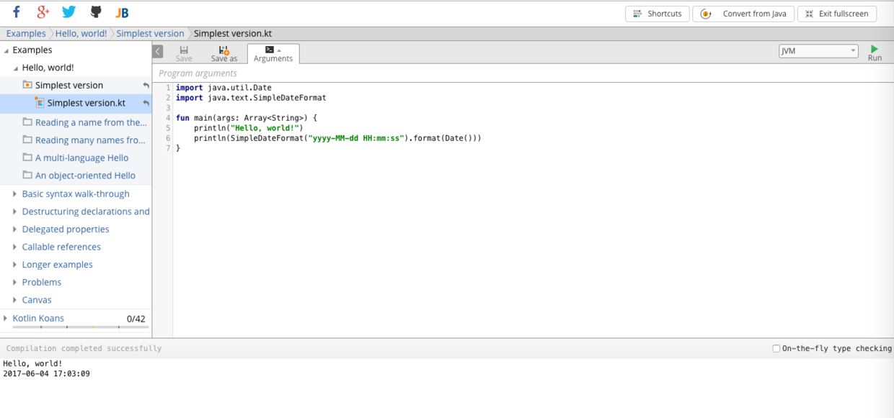

### 1.2.2 本地命令行环境搭建

Kotlin是运行在JVM环境下的语言。首先我们要有JDK环境。

有时候我们并不需要打开IDE来做一些事情。打开 IDE 是件很麻烦的事情，在某些场景下，我们比较喜欢命令行。

使用命令行环境，我们可以方便地使用Kotlin REPL（Read-Eval-Print-Loop，交互式编程环境）。REPL可以实时编写Kotlin代码，并查看运行结果。通常REPL交互方式可以用于调试、测试以及试验某种想法。

下面我们讲下怎么搭建 Kotlin 命令行环境。

Kotlin 命令行环境主要依赖就是Kotlin Compiler，目前最新版本是 1.1.2-2。其下载链接是：

https://github.com/JetBrains/kotlin/releases/tag/v1.1.2-2

这个zip包里面就是Kotlin Compiler的核心依赖jar包。解压后，目录结构如下：

```
.
├── bin
│   ├── kotlin
│   ├── kotlin.bat
│   ├── kotlinc
│   ├── kotlinc-js
│   ├── kotlinc-js.bat
│   ├── kotlinc-jvm
│   ├── kotlinc-jvm.bat
│   └── kotlinc.bat
├── build.txt
├── lib
│   ├── allopen-compiler-plugin.jar
│   ├── android-extensions-compiler.jar
│   ├── kotlin-annotation-processing.jar
│   ├── kotlin-ant.jar
│   ├── kotlin-build-common-test.jar
│   ├── kotlin-compiler-client-embeddable.jar
│   ├── kotlin-compiler.jar
│   ├── kotlin-daemon-client.jar
│   ├── kotlin-jslib-sources.jar
│   ├── kotlin-jslib.jar
│   ├── kotlin-preloader.jar
│   ├── kotlin-reflect.jar
│   ├── kotlin-runner.jar
│   ├── kotlin-runtime-sources.jar
│   ├── kotlin-runtime.jar
│   ├── kotlin-script-runtime-sources.jar
│   ├── kotlin-script-runtime.jar
│   ├── kotlin-stdlib-js-sources.jar
│   ├── kotlin-stdlib-js.jar
│   ├── kotlin-stdlib-sources.jar
│   ├── kotlin-stdlib.jar
│   ├── kotlin-test-js.jar
│   ├── kotlin-test.jar
│   ├── noarg-compiler-plugin.jar
│   ├── sam-with-receiver-compiler-plugin.jar
│   └── source-sections-compiler-plugin.jar
└── license
    ├── LICENSE.txt
    ├── NOTICE.txt
    └── third_party
        ├── args4j_LICENSE.txt
        ├── asm_license.txt
        ├── closure-compiler_LICENSE.txt
        ├── dart_LICENSE.txt
        ├── jshashtable_license.txt
        ├── json_LICENSE.txt
        ├── maven_LICENSE.txt
        ├── pcollections_LICENSE.txt
        ├── prototype_license.txt
        ├── rhino_LICENSE.txt
        ├── scala_license.txt
        ├── trove_license.txt
        └── trove_readme_license.txt

4 directories, 50 files
```

其中，kotlinc，kotlin两个命令就是Kotlin语言的编译.kt文件和运行Kt.class文件命令。

我们来看一下kotlinc的命令：

```bash
#!/usr/bin/env bash
#
##############################################################################
# Copyright 2002-2011, LAMP/EPFL
# Copyright 2011-2015, JetBrains
#
# This is free software; see the distribution for copying conditions.
# There is NO warranty; not even for MERCHANTABILITY or FITNESS FOR A
# PARTICULAR PURPOSE.
##############################################################################

cygwin=false;
case "`uname`" in
    CYGWIN*) cygwin=true ;;
esac

# Based on findScalaHome() from scalac script
findKotlinHome() {
    local source="${BASH_SOURCE[0]}"
    while [ -h "$source" ] ; do
        local linked="$(readlink "$source")"
        local dir="$(cd -P $(dirname "$source") && cd -P $(dirname "$linked") && pwd)"
        source="$dir/$(basename "$linked")"
    done
    (cd -P "$(dirname "$source")/.." && pwd)
}

KOTLIN_HOME="$(findKotlinHome)"

if $cygwin; then
    # Remove spaces from KOTLIN_HOME on windows
    KOTLIN_HOME=`cygpath --windows --short-name "$KOTLIN_HOME"`
fi

[ -n "$JAVA_OPTS" ] || JAVA_OPTS="-Xmx256M -Xms32M"

declare -a java_args
declare -a kotlin_args

while [ $# -gt 0 ]; do
  case "$1" in
    -D*)
      java_args=("${java_args[@]}" "$1")
      shift
      ;;
    -J*)
      java_args=("${java_args[@]}" "${1:2}")
      shift
      ;;
    *)
      kotlin_args=("${kotlin_args[@]}" "$1")
      shift
      ;;
  esac
done

if [ -z "$JAVACMD" -a -n "$JAVA_HOME" -a -x "$JAVA_HOME/bin/java" ]; then
    JAVACMD="$JAVA_HOME/bin/java"
fi

declare -a kotlin_app

if [ -n "$KOTLIN_RUNNER" ];
then
    java_args=("${java_args[@]}" "-Dkotlin.home=${KOTLIN_HOME}")
    kotlin_app=("${KOTLIN_HOME}/lib/kotlin-runner.jar" "org.jetbrains.kotlin.runner.Main")
else
    [ -n "$KOTLIN_COMPILER" ] || KOTLIN_COMPILER=org.jetbrains.kotlin.cli.jvm.K2JVMCompiler
    java_args=("${java_args[@]}" "-noverify")
    kotlin_app=("${KOTLIN_HOME}/lib/kotlin-preloader.jar" "org.jetbrains.kotlin.preloading.Preloader" "-cp" "${KOTLIN_HOME}/lib/kotlin-compiler.jar" $KOTLIN_COMPILER)
fi

"${JAVACMD:=java}" $JAVA_OPTS "${java_args[@]}" -cp "${kotlin_app[@]}" "${kotlin_args[@]}"
```

我们可以看出，kotlinc是直接依赖java命令的，所以，使用Kotlin Compiler，首先要有JDK环境。

其中kotlin-preloader.jar、kotlin-compiler.jar是其入口依赖jar，入口类是org.jetbrains.kotlin.cli.jvm.K2JVMCompiler。

kotlin命令脚本如下

```bash
export KOTLIN_RUNNER=1

DIR="${BASH_SOURCE[0]%/*}"
: ${DIR:="."}

"${DIR}"/kotlinc "$@"
```

我们可以看出，直接是依赖kotlinc。在if逻辑代码中：

```bash
if [ -n "$KOTLIN_RUNNER" ];
then
    java_args=("${java_args[@]}" "-Dkotlin.home=${KOTLIN_HOME}")
    kotlin_app=("${KOTLIN_HOME}/lib/kotlin-runner.jar" "org.jetbrains.kotlin.runner.Main")
```
从这个逻辑，我们可以看出，Kt.class在java命令执行前，需要从kotlin-runner.jar这个逻辑里走一遍。同时，我们也能知道Kt.class跟Java.class文件有着这个kotlin-runner.jar的逻辑映射上的区别。也就是说，Kotlin的Bytecode跟纯的JVM bytecode存在一个kotlin-runner.jar的映射关系。其大致执行过程如下图所示：

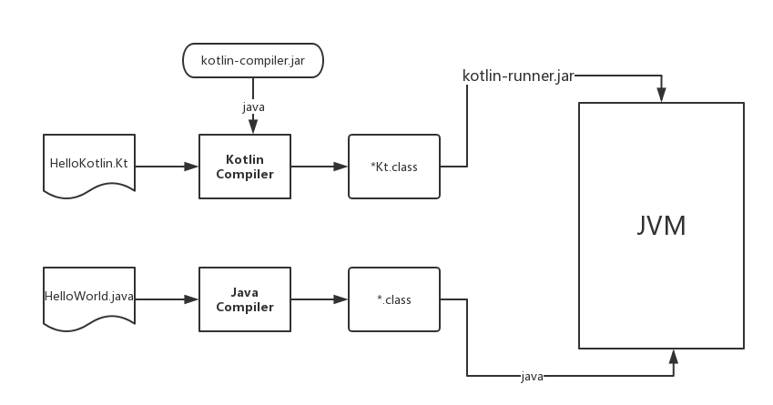

像scala，groovy等基于JVM的语言的compiler,runner，基本都采用这种运行方式。在实现细节上也许会有不同，总的思路是一致的。比如说，scalac的入口类

```
https://github.com/EasyKotlin/scala/blob/2.12.x/src/compiler/scala/tools/nsc/Main.scala

```
对应scalac中的命令行脚本是：

```bash
...

execCommand \
  "${JAVACMD:=java}" \
  $JAVA_OPTS \
  "${java_args[@]}" \
  "${classpath_args[@]}" \
  -Dscala.home="$SCALA_HOME" \
  $OVERRIDE_USEJAVACP \
  "$EMACS_OPT" \
  $WINDOWS_OPT \
   scala.tools.nsc.Main  "$@"
   
   ...
```
我们解压完kotlin-compiler-1.1.2-2.zip，放到相应的目录下。然后配置系统环境变量：
```
export KOTLIN_HOME=/Users/jack/soft/kotlinc
export PATH=$PATH:$KOTLIN_HOME/bin
```

执行`source ~/.bashrc`, 命令行输入`kotlinc`， 即可REPL环境，我们可以看到如下输出：

```bash
$ kotlinc
Welcome to Kotlin version 1.1.2-2 (JRE 1.8.0_40-b27)
Type :help for help, :quit for quit
>>> println("Hello,World")
Hello,World
>>> 
```

然后，我们就可以像使用python,ruby,scala,groovy的REPL一样去尽情享受Kotlin的编程乐趣了。


### 1.2.3 使用IntelliJ IDEA

最新版本的IDEA已经默认集成了Kotlin环境。

我们首先去下载安装IntelliJ IDEA。下载页面是：

https://www.jetbrains.com/idea/download/index.html

如果您之前没用过IDEA，现在想尝试一下，可以去下面这个页面了解一下：

https://www.jetbrains.com/idea/documentation/

安装完毕，然后点击`File > New > Project`, 我们可以选择

> Koltin: Kotlin(JVM), Kotlin(JavaScript)

如下图所示

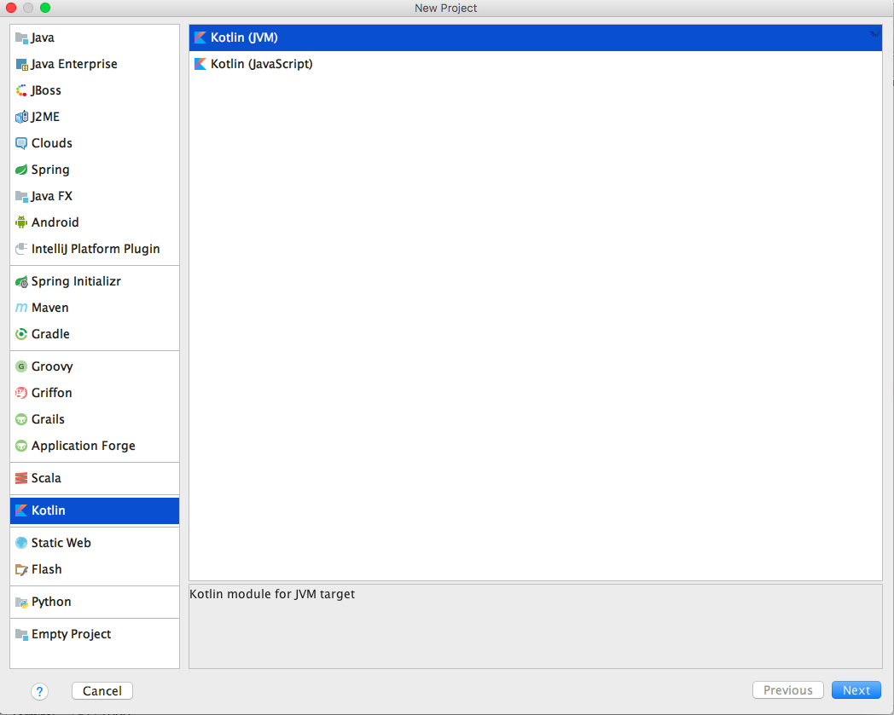

也可以选择Maven，Gradle构建工程。本书采用Gradle来构建工程。如下图所示：

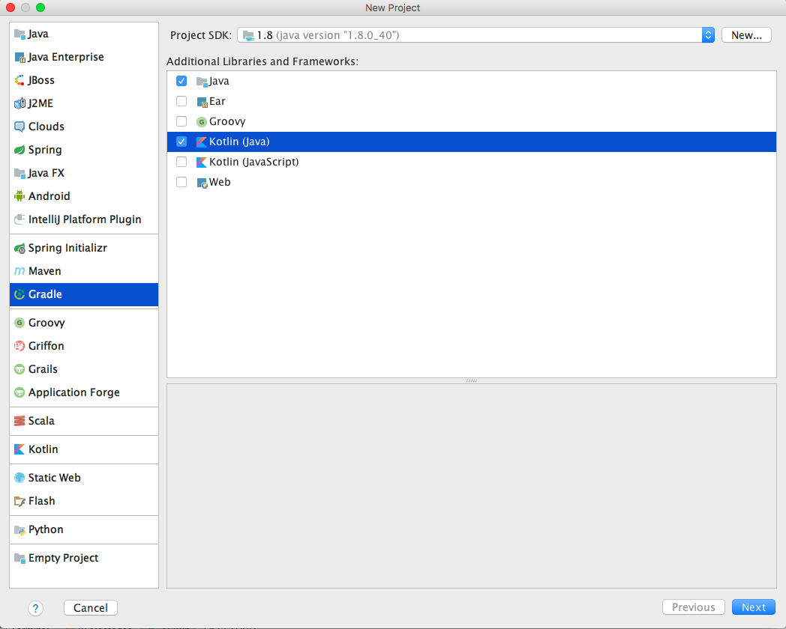

然后按照后续步骤操作，最后等待Gradle下载依赖，完成工程构建。我们将得到一个标准的Gradle工程。

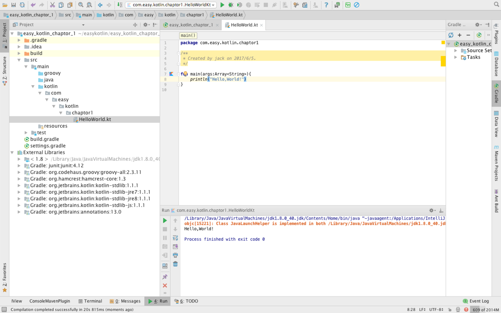

我们在`src/main/kotlin`下面新建`package` :com.easy.kotlin.chapter1

然后新建HelloWorld.kt，编写以下代码

```kotlin
package com.easy.kotlin.chapter1

fun main(args:Array<String>){
    println("Hello,World!")
}
```

右击运行该类，如下图

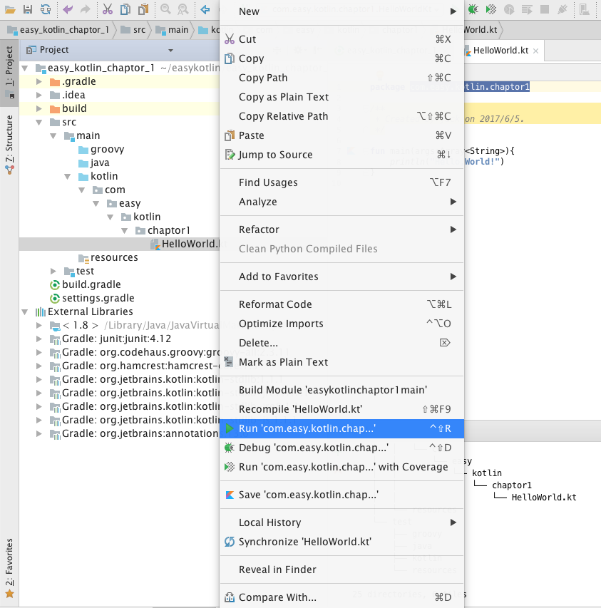

我们将会得到输出

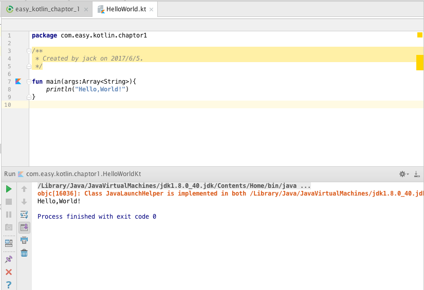

我们观察IDEA控制台输出的执行日志，可以看出IDEA集成Kotlin环境使用的核心依赖jar包：

```
/Library/Java/JavaVirtualMachines/jdk1.8.0_40.jdk/Contents/Home/bin/java "-javaagent:/Applications/IntelliJ IDEA.app/Contents/lib/idea_rt.jar=65404:/Applications/IntelliJ IDEA.app/Contents/bin" -Dfile.encoding=UTF-8 -classpath /Library/Java/JavaVirtualMachines/jdk1.8.0_40.jdk/Contents/Home/jre/lib/charsets.jar:/Library/Java/JavaVirtualMachines/jdk1.8.0_40.jdk/Contents/Home/jre/lib/deploy.jar:...
...

.../kotlin-stdlib-jre8-1.1.1.jar:
.../kotlin-stdlib-jre7-1.1.1.jar:
.../kotlin-stdlib-1.1.1.jar:... com.easy.kotlin.chapter1.HelloWorldKt
...


Hello,World!

Process finished with exit code 0
```

本小节的示例工程代码：https://github.com/EasyKotlin/easy_kotlin_chaptor_1

### 1.2.4 使用Eclipse

使用Eclipse的开发者们，可以通过安装Kotlin插件来进行Kotlin程序的开发。但是，体验上要比使用IDEA逊色很多。如果您想完美体验Kotlin在IDE中的开发，强烈建议使用IDEA。JetBrains自家的东西，自然是比Eclipse支持的要好很多。

我们下面简单介绍一下在Eclipse中开发Kotlin程序的方法。

首先，打开`Help > Eclipse Marketplace`, 如下图

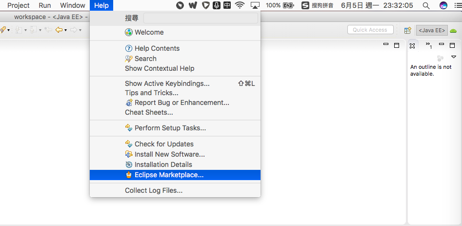

在搜索框里输入`Kotlin` , 将得到如下结果

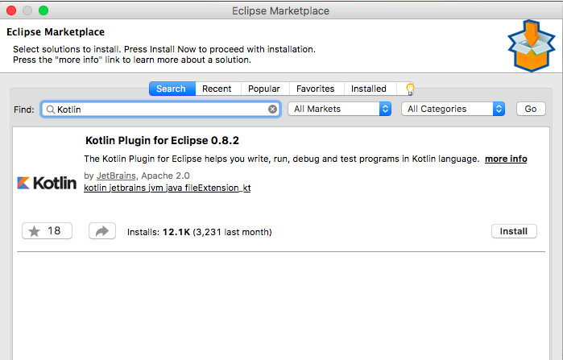

点击`Install`, 等待完成安装，重启Eclipse。

然后，选择`Kotlin Perspective` , 如下图

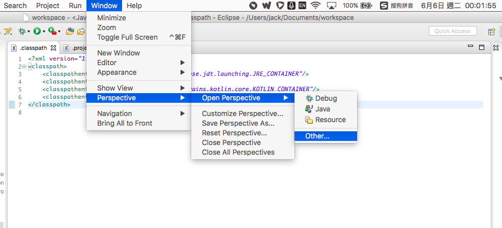

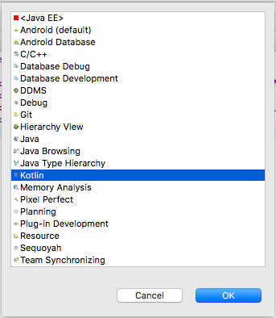

点击OK。下面我们就可以新建 `Kotlin` 工程了。如下图

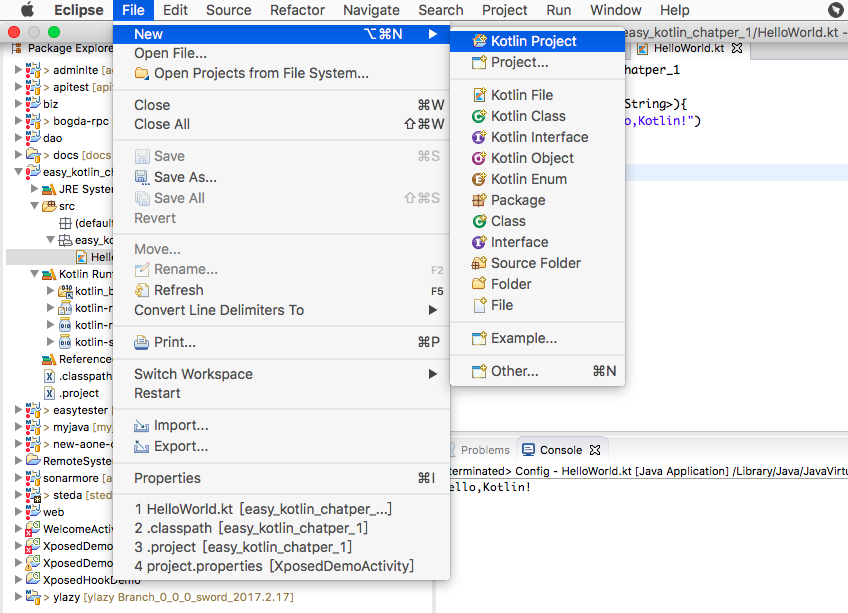

新建完工程，我们将得到如下结构的工程

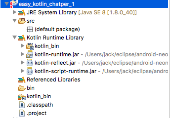

我们可以看出，`kotlin-runtime.jar`, `kotlin-reflect.jar`,`kotlin-script-runtime.jar` 被加到了工程依赖库里。

这个配置是在`.classpath`， `.project` 配置的。当然这些配置依赖库，执行程序等等的工作是由Eclipse Kotlin插件完成的。

我们在`src`目录新建一个`package` :  easy_kotlin_chatper_1

然后在此`package`下面新建一个`HelloWorld.kt`源码文件，内容如下

```kotlin
package easy_kotlin_chatper_1

fun main(args: Array<String>){
	println("Hello,Kotlin!")
}
```

如下图

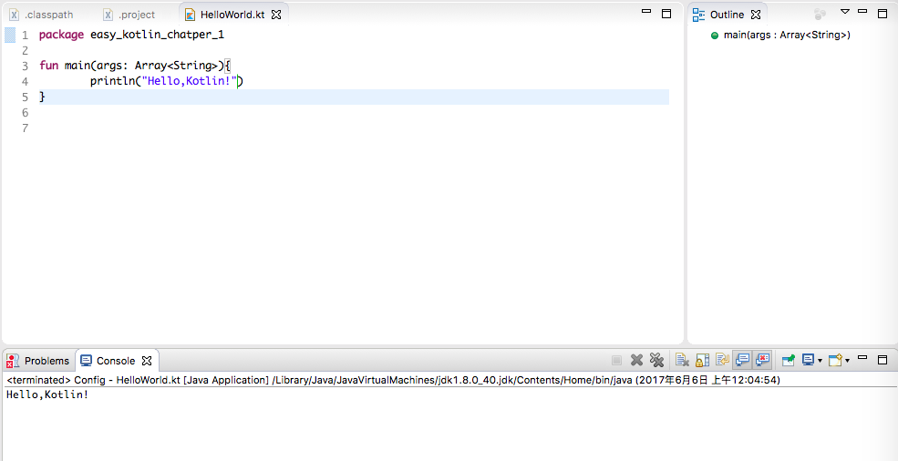

右击`HelloWorld.kt`源码文件，如下图运行

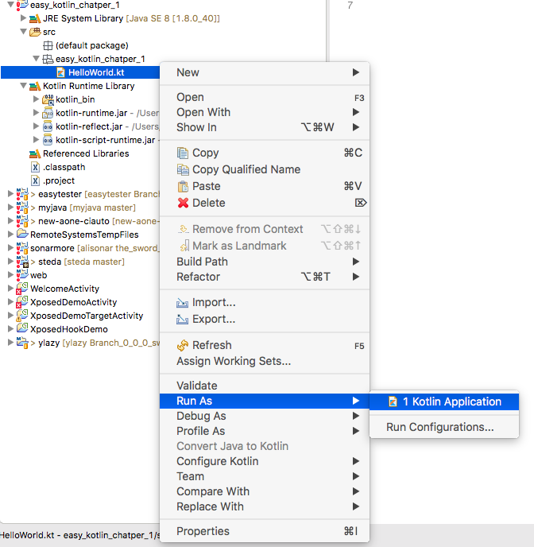

如果一切正常，我们将得到如下输出

```
Hello,Kotlin!
```

本节示例工程源码：https://github.com/EasyKotlin/easy_kotlin_chatper_1

### 1.2.5 使用Gradle构建Kotlin工程

我们在上面小节中展示了使用IntelliJ IDEA建立一个Kotlin Gradle工程的步骤。我们在本节简单介绍一下使用Gradle构建Kotlin工程的配置。这个配置主要在build.gradle文件中。

其中，构建过程的核心依赖配置如下：

```gradle
buildscript {
    ext.kotlin_version = '1.1.1'

    repositories {
        mavenCentral()
    }
    dependencies {
        classpath "org.jetbrains.kotlin:kotlin-gradle-plugin:$kotlin_version"
    }
}
```
kotlin-gradle-plugin完成了Gradle构建Kotlin工程的所有依赖构建执行的相关工作。

然后，使用Gradle java、kotlin插件：

```gradle
apply plugin: 'java'
apply plugin: 'kotlin'
```

当然，如果我们同时想使用Groovy语言，加上

```gradle
apply plugin: 'groovy'
```

源代码JDK兼容性配置兼容1.8往后的版本：
```gradle
sourceCompatibility = 1.8
```

配置Maven仓库：

```gradle
repositories {
    mavenCentral()
}
```

工程依赖：

```gradle
dependencies {
    compile "org.jetbrains.kotlin:kotlin-stdlib-jre8:$kotlin_version"
    compile "org.jetbrains.kotlin:kotlin-stdlib-js:$kotlin_version"
    compile 'org.codehaus.groovy:groovy-all:2.3.11'
    testCompile group: 'junit', name: 'junit', version: '4.12'
}

```
其中，kotlin-stdlib-jre8是Kotlin JVM执行环境依赖。

org.jetbrains.kotlin:kotlin-stdlib-js是Kotlin JS执行环境依赖。

我们可以通过Gradle项目的依赖树看出kotlin-stdlib-jre8依赖

>org.jetbrains.kotlin:kotlin-stdlib:1.1.1

如下图

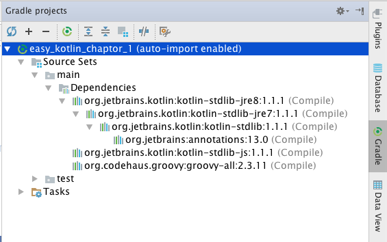

kotlin-stdlib是Kotlin运行环境的标准库。

### 1.2.6 编程语言学习小结

学习一门语言大概会经历如下几步。

1.基本语法

学习任何东西，都是一个由表及里的过程。学习一门编程语言也一样。对于一门编程语言来说，“表” 就是基本词汇和语法。

对于基础语法的学习，我们可以看一些简短而又系统的教程。

2.编码实践

所谓“纸上得来终觉浅，绝知此事要躬行”是也。此处就不多说。

> 掌握基础，持续练习

每一门编程语言的学习内容都会涉及：

- 运行环境
- 数据类型（数字、字符串、数组、集合、映射字典等）
- 表达式
- 函数
- 流程控制
- 类、方法

等等，不同的语言还有一些不同的特性，可以通过对比学习来加深理解。并通过大量实践深入理解，达到熟练使用。后面还要再去深入了解面向对象编程OOP、函数式编程FP、并发、异常、文件IO、网络、标准库等内容，并辅以持续的练习，这些内容才能够让你真正进入编程领域并做出实际的软件。

> 相信10000小时定律，No Pain, No Gain。

学习一门新的语言的时候，要利用以前所学的语言的功底，但是也要保持开放的心态。这些在认知心理学中有相应的讲述。感兴趣的读者可以去了解一下。

3.技近乎道

基础语法学习，能让你快速上手，应用实践。对技巧和坑的关注，一定程度上拓展了你的知识面。系统学习，一方面会进一步拓展你的知识面。另一方面，也有利于你语言知识结构的形成。

任何一门成熟语言，都有其特有的生态。这个生态包括:  框架，扩展包，解决方案，模式, 规范等。

在不断编码实践过程中，我们逐步熟练使用很多API库、框架，也不断踩坑填坑、看源代码、不断解决问题，不断加深对语言的理解，同时会看一些优秀的框架源代码。

如果还有精力，我们再去学习语言更底层的东西，而不仅仅停留在应用层面。如Java中的集合类实现的算法与数据结构，如JVM是如何执行Java代码的。如Java的线程和操作系统线程的关系。以及一些操作系统方面的知识。

最后，达到游刃有余的境界。这一层级，基本可入武林高手之列了。

> 庖丁释刀对曰：“臣之所好者，道也，进乎技矣。始臣之解牛之时，所见无非牛者。三年之后，未尝见全牛也。方今之时，臣以神遇而不以目视，官知止而神欲行。依乎天理，批大郤，导大窾，因其固然，技经肯綮之未尝，而况大軱乎！

这里的“牛”，可以理解为我们所说的各种编程思想，编程范式，编程方法，编程技巧等等。最后，达到“运用之妙，存乎一心”之境也。

4.创造新世界

> 编程的本质就是创造世界。

达到这个境界的，基本都是世界顶尖大牛了。

例如，编程语言发展史上的杰出人物（下面只是一份不完全名单）：

```
约翰·冯·诺伊曼: 操作系统概念的发起者
肯·汤普逊&丹尼斯·里奇: 发明了C和Unix
约翰·巴科斯：发明了Fortran
阿兰·库珀：开发了Visual Basic
詹姆斯·高斯林：开发了Oak，即后来的Java
安德斯·海尔斯伯格：开发了Turbo Pascal、Delphi，以及C#
葛丽丝·霍普，开发了Flow-Matic，该语言对COBOL造成了影响
肯尼斯·艾佛森：，开发了APL，并与Roger Hui合作开发了J
比尔·乔伊：发明了vi，BSD，Unix的前期作者，以及SunOS的发起人，该操作系统后来改名为Solaris
艾伦·凯：开创了面向对象编程语言，以及Smalltalk的发起人
Brian Kernighan：与丹尼斯·里奇合著第一本C程序设计语言的书籍，同时也是AWK与AMPL程序设计语言的共同作者
约翰·麦卡锡：发明了LISP
比雅尼·斯特劳斯特鲁普：开发了C++
尼克劳斯·维尔特：发明了Pascal与Modula
拉里·沃尔：创造了Perl与Perl 6
吉多·范罗苏姆：创造了Python
......

```

这些人，都在创造一个美妙的思维逻辑之塔，创造一个新世界。正是这些各个编程领域的引领者们，才使得我们这个世界更加美好。

小结
===

本章我们简单介绍了Kotlin语言的发展过程，以及Kotlin开发环境的搭建方法。简单总结了学习一门编程语言的基本过程。我们的这本书基本是按照这个思路组织架构的。

我们将在下一章进入快速开始：Hello,World! 

感谢您的阅读！恭喜您已经正式开启Kotlin世界之旅，希望本书能够帮到您的学习，哪怕是一点点启发也倍感欣慰。

本书所涉及到的示例工程代码统一放在这里：https://github.com/EasyKotlin 

参考资料
===
1.http://www.onboard.jetbrains.com/articles/04/10/lop/index.html
2.https://medium.com/@octskyward/why-kotlin-is-my-next-programming-language-c25c001e26e3
3.http://kotlinlang.org/docs/tutorials/command-line.html
4.http://hadihariri.com/2013/12/29/jvm-minimal-survival-guide-for-the-dotnet-developer/