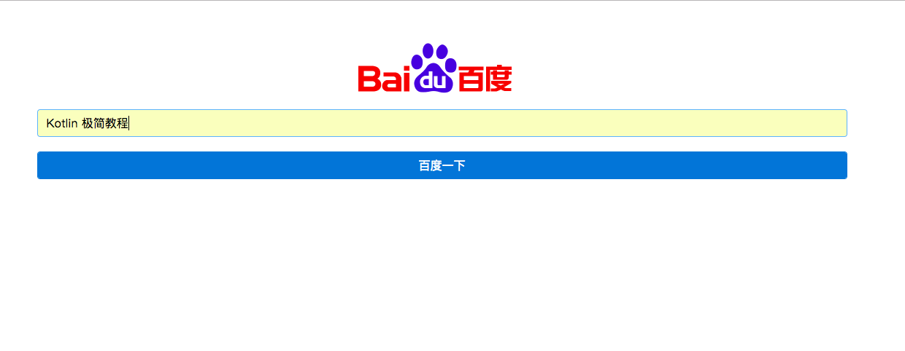

第14章 使用 Kotlin  DSL
===

我们在前面的章节中，已经看到了 Kotlin DSL 的强大功能。例如Gradle 的配置文件 build.gradle （Groovy），以及前面我们涉及到的Gradle Script Kotlin（Kotlin）、Anko（Kotlin）等，都是 DSL。我们可以看出，使用DSL的编程风格，可以让程序更加简单干净、直观简洁。当然，我们也可以创建自己的 DSL。

本章就让我们一起来学习一下 使用 Kotlin 创建 DSL的相关内容。

我们在上一章中已经看到了在 Android 中使用下面这样的 嵌套DSL 风格的代码来替代 XML 式风格的视图文件

```kotlin
UI {
    // AnkoContext

    verticalLayout {
        padding = dip(30)
        var title = editText {
            // editText 视图
            id = R.id.todo_title
            hintResource = R.string.title_hint
        }

        var content = editText {
            id = R.id.todo_content
            height = 400
            hintResource = R.string.content_hint
        }
        button {
            // button 视图
            id = R.id.todo_add
            textResource = R.string.add_todo
            textColor = Color.WHITE
            setBackgroundColor(Color.DKGRAY)
            onClick { _ -> createTodoFrom(title, content) }
        }
    }
}
```
相比 XML 风格的 DSL（XML 本质上讲也是一种 DSL），明显使用原生的编程语言（例如Kotlin）DSL 风格更加简单干净，也更加自由灵活。

Kotlin DSL 的编程风格是怎样的呢？以及其背后实现的原理是怎样的呢？下面就让我一起来探讨一下。

## DSL 是什么

DSL（Domain-Specific Language，领域特定语言）指的是专注于特定问题领域的计算机语言（领域专用语言）。不同于通用的计算机语言(GPL)，领域特定语言只用在某些特定的领域。 比如用来显示网页的HTML语言，以及Emacs所使用的Emac LISP语言等。更加典型的例子是Gradle，它基于Ant 和 Maven，使用基于Groovy的DSL 来声明项目设置，而不是传统的XML。

DSL 简单讲就是对一个特定问题 (受限的表达能力) 的方案模型的更高层次的抽象表达（领域语言），使其更加简单易懂 (容易理解的语义以及清晰的语义模型)。

DSL 只是问题解决方案模型的外部封装，这个模型可能是一个 API 库，也可能是一个完整的框架等等。DSL 提供了思考特定领域问题的模型语言，这使得我们可以更加简单高效地来解决问题。DSL 聚焦一个特定的领域，简单易懂，功能极简但完备。DSL 让我们理解和使用模型更加简易。

提示：关于 DSL 的详细介绍可以参考：《领域特定语言》（Martin Fowler）这本书。

## Kotlin 的 DSL 特性支持

扩展（eXtension）特性。

## 实现一个极简的 DSL

OkHttp是一个成熟且强大的网络库，在Android源码中已经使用OkHttp替代原先的HttpURLConnection。很多著名的框架例如Picasso、Retrofit也使用OkHttp作为底层框架。在这里我对OkHttp做一下简单的封装，其实封装得有点粗暴只是为了演示如何实现dsl。

```kotlin
import io.reactivex.BackpressureStrategy
import io.reactivex.Flowable
import io.reactivex.schedulers.Schedulers
import okhttp3.OkHttpClient
import okhttp3.Request
import okhttp3.RequestBody
import okhttp3.Response
import java.util.concurrent.TimeUnit

class RequestWrapper {

    var url:String? = null

    var method:String? = null

    var body: RequestBody? = null

    var timeout:Long = 10

    internal var _success: (String) -> Unit = { }
    internal var _fail: (Throwable) -> Unit = {}

    fun onSuccess(onSuccess: (String) -> Unit) {
        _success = onSuccess
    }

    fun onFail(onError: (Throwable) -> Unit) {
        _fail = onError
    }
}

fun http(init: RequestWrapper.() -> Unit) {
    val wrap = RequestWrapper()

    wrap.init()

    executeForResult(wrap)
}

private fun executeForResult(wrap:RequestWrapper) {

    Flowable.create<Response>({
        e -> e.onNext(onExecute(wrap))
    }, BackpressureStrategy.BUFFER)
            .subscribeOn(Schedulers.io())
            .subscribe(
                    { resp ->
                        wrap._success(resp.body()!!.string())
                    },

                    { e -> wrap._fail(e) })
}

private fun onExecute(wrap:RequestWrapper): Response? {

    var req:Request? = null
    when(wrap.method) {

        "get","Get","GET" -> req =Request.Builder().url(wrap.url).build()
        "post","Post","POST" -> req = Request.Builder().url(wrap.url).post(wrap.body).build()
        "put","Put","PUT" -> req = Request.Builder().url(wrap.url).put(wrap.body).build()
        "delete","Delete","DELETE" -> req = Request.Builder().url(wrap.url).delete(wrap.body).build()
    }

    val http = OkHttpClient.Builder().connectTimeout(wrap.timeout, TimeUnit.SECONDS).build()
    val resp = http.newCall(req).execute()
    return resp
}

```
封装完OkHttp之后，看看如何来编写get请求
```kotlin
http {

    url = "http://www.163.com/"

    method = "get"

    onSuccess {
        string -> L.i(string)
    }

    onFail {
        e -> L.i(e.message)
    }
}
```

是不是很像以前用jquery来写ajax？

post请求也是类似的，只不过多了body

```kotlin
var json = JSONObject()
json.put("xxx","yyyy")
....

val postBody = RequestBody.create(MediaType.parse("application/json; charset=utf-8"),json.toString())

http {

    url = "https://......"

    method = "post"

    body = postBody

    onSuccess {
        string -> L.json(string)
    }

    onFail {
        e -> L.i(e.message)
    }
}
```

## 使用kotlinx.html DSL 写前端代码

kotlinx.html是可在 Web 应用程序中用于构建 HTML 的 DSL。 它可以作为传统模板系统（例如JSP、FreeMarker等）的替代品。

kotlinx. html 分别提供了kotlinx-html-jvm 和 kotlinx-html-js库的DSL , 用于在 JVM 和浏览器 (或其他 javascript 引擎) 中直接使用 Kotlin 代码来构建 html, 直接解放了原有的 HTML 标签式的前端代码。这样，我们 也可以使用 Kotlin来先传统意义上的 HTML 页面了。 Kotlin Web 编程将会更加简单纯净。

提示： 更多关于kotlinx.html的相关内容可以参考它的 Github 地址 ：https://github.com/Kotlin/kotlinx.html

要使用 kotlinx.html 首先添加依赖

```gradle
dependencies {
    def kotlinx_html_version = "0.6.3"
    compile "org.jetbrains.kotlinx:kotlinx-html-jvm:${kotlinx_html_version}"
    compile "org.jetbrains.kotlinx:kotlinx-html-js:${kotlinx_html_version}"
    ...
}
```
kotlinx.html 最新版本发布在 https://jcenter.bintray.com/ 仓库上，所以我们添加一下仓库的配置
```gradle
repositories {
    maven { url 'https://jitpack.io' }
    mavenCentral()
    jcenter() // https://jcenter.bintray.com/ 仓库
    maven { url "https://repo.spring.io/snapshot" }
    maven { url "https://repo.spring.io/milestone" }
}
```

我们来写一个极简百度首页示例。这个页面界面如下图所示



前端 HTML 代码：

```html
<!DOCTYPE html>
<html lang=zh-CN>
<head>
    <meta charset="utf-8">
    <meta http-equiv="X-UA-Compatible" content="IE=edge">
    <meta name=viewport content="width=device-width,initial-scale=1">
    <title>百度一下</title>
    <link href="https://cdn.bootcss.com/bootstrap/4.0.0-alpha.6/css/bootstrap.min.css" rel="stylesheet">
    <script src="https://cdn.bootcss.com/jquery/3.2.1/jquery.min.js"></script>
    <link href="dsl.css" rel="stylesheet">
    <script src="dsl.js"></script>
</head>
<body>
<div class="container">
    <div class="ipad center">
        
    </div>

    <form class="form">
        <input id="wd" class="form-control ipad">
        <button id="baiduBtn" type="submit" class="btn btn-primary form-control ipad">百度一下</button>
    </form>
</div>
</body>
</html>
```

其中，dsl.css文件内容如下
```css
.ipad {
    margin: 10px
}

.center {
    text-align: center;
}
```

dsl.js 文件内容如下
```javascript
$(function () {
    $('#baiduBtn').on('click', function () {
        var wd = $('#wd').val()
        window.open("https://www.baidu.com/s?wd=" + wd)
    })
})
```

上面我们是通常使用的 HTML+JS+CSS 的方式来写前端页面的方法。现在我们把 HTML 部分的代码用Kotlin 的 DSL  kotlinx.html 来重新实现一遍。

我们首先新建 Kotlin + Spring Boot 工程，然后直接来写 Kotlin 视图类HelloDSLView，代码如下：

```kotlin
package com.easy.kotlin.chapter14_kotlin_dsl.view

import kotlinx.html.*
import kotlinx.html.stream.createHTML
import org.springframework.stereotype.Service

@Service
class HelloDSLView {
    fun html(): String {
        return createHTML().html {
            head {
                meta {
                    charset = "utf-8"
                    httpEquiv = "X-UA-Compatible"
                    content = "IE=edge"
                }
                title("百度一下")
                link {
                    href = "https://cdn.bootcss.com/bootstrap/4.0.0-alpha.6/css/bootstrap.min.css"
                    rel = "stylesheet"
                }
                script {
                    src = "https://cdn.bootcss.com/jquery/3.2.1/jquery.min.js"
                }
                link {
                    href = "dsl.css"
                    rel = "stylesheet"
                }
                script {
                    src = "dsl.js"
                }
            }

            body {
                div(classes = "container") {
                    div(classes = "ipad center") {
                        img {
                            src = "https://www.baidu.com/img/bd_logo1.png"
                            width = "270"
                            height = "129"
                        }
                    }

                    form(classes = "form") {
                        input(InputType.text, classes = "form-control ipad") {
                            id = "wd"
                        }
                        button(classes = "btn btn-primary form-control ipad") {
                            id = "baiduBtn"
                            type = ButtonType.submit
                            text("百度一下")

                        }
                    }

                }
            }
        }
    }
}
```
相比之下，我们使用 DSL 的风格要比原生 HTML 要简洁优雅。关键是，我们的这个 HTML 是用 Kotlin 写的，这也就意味着，我们的 HTML 代码不再是简单的静态的前端代码了。我们完全可以直接使用后端的接口返回数据来给 HTML 元素赋值，我们也完全具备了（当然是完全超越了）诸如 JSP、Freemarker 这样的视图模板引擎的各种判断、循环等的语法功能，因为我们直接使用的是一门强大的编程语言 Kotlin 来写的 HTML 代码 。

然后，我们就可以直接在控制器层的代码里直接调用我们的 Kotlin 视图代码了：

```kotlin
@Controller
class HelloDSLController {
    @Autowired
    var helloDSLView: HelloDSLView? = null

    @GetMapping("hello")
    fun helloDSL(model: Model): ModelAndView {
        model.addAttribute("hello", helloDSLView?.html())
        return ModelAndView("hello")
    }
}
```

为了简单起见，我们借用一下 Freemarker 来做视图解析引擎，但是它只负责原封不动地来传输我们的 Kotlin 视图代码。hello.ftl 代码如下：

```
${hello}
```
我们的源码目录如下

```
── src
    ├── main
    │   ├── java
    │   ├── kotlin
    │   │   └── com
    │   │       └── easy
    │   │           └── kotlin
    │   │               └── chapter14_kotlin_dsl
    │   │                   ├── Chapter14KotlinDslApplication.kt
    │   │                   ├── controller
    │   │                   │   └── HelloDSLController.kt
    │   │                   └── view
    │   │                       └── HelloDSLView.kt
    │   └── resources
    │       ├── application.properties
    │       ├── banner.txt
    │       ├── static
    │       │   ├── dsl.css
    │       │   ├── dsl.js
    │       │   └── hello.html
    │       └── templates
    │           └── hello.ftl
    └── test
        ├── java
        ├── kotlin
        │   └── com
        │       └── easy
        │           └── kotlin
        │               └── chapter14_kotlin_dsl
        │                   └── Chapter14KotlinDslApplicationTests.kt
        └── resources

```

然后，启动运行 SpringBoot 应用，浏览器访问  http://127.0.0.1:8888/hello ， 我们可以看到如下输出界面：


这就是 DSL 的精妙之处。我们后面可以尝试使用 kotlinx.html 来写Kotlin 语言的前端代码了。在做 Web 开发的时候，我们通常是使用 HTML + 模板引擎（Velocity、JSP、Freemarker 等）来集成前后端的代码，这让我们有时候感到很尴尬，要学习模板引擎的语法，还得应对 前端HTML代码中凌乱的模板引擎标签、变量等片段代码。

使用 Kotlin DSL 来写 HTML 代码的情况将完全不一样了，我们将重拾前后端集成编码的乐趣（不再是模板引擎套前端 HTML，各种奇怪的 #、<#>、${} 模板语言标签），我们直接把 更加优雅简单的 DSL 风格的HTML 代码搬到了后端，同时HTML中的元素将直接跟后端的数据无缝交互，而完成这些的只是 Kotlin（当然，相应领域的 DSL 基本语义模型还是要学习一下）。

提示：本节项目源码：https://github.com/EasyKotlin/chapter14_kotlin_dsl