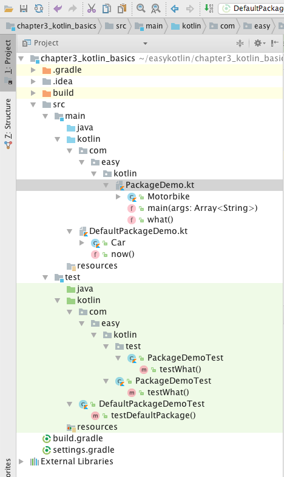
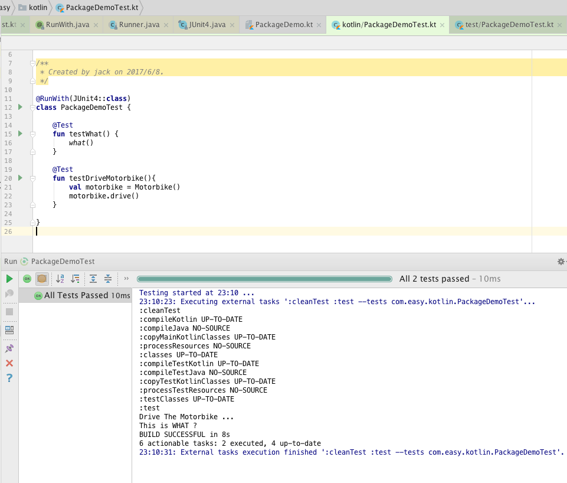
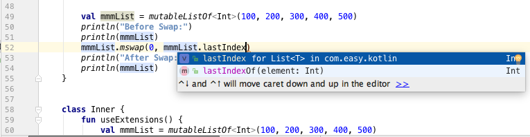

第3章 Kotlin语言基础
===

> 掌握基础，持续练习

学习任何东西，都是一个由表及里的过程。学习一门编程语言也一样。对于一门编程语言来说，“表” 就是基本词汇（关键字、标识符等）、句子（表达式）和语法。

每一门编程语言的学习内容都会涉及： 运行环境、基础数据类型（数字、字符串、数组、集合、映射字典等） 、表达式、 流程控制 、类、方法（函数）等等，不同的语言会借鉴其他的语言特性，同时也会有各自的特性。这样我们就可以通过对比学习来加深理解。另外，我们还通过大量实践深入理解，达到熟练使用。

所谓“纸上得来终觉浅，绝知此事要躬行”是也。下面让我们开始吧。

## 3.1 包（package）

我们先来举个例子。比如说，程序员A写了一个类叫 JSON , 程序员B也写了一个类叫 JSON。然后，我们在写代码的时候，想要同时使用这两个类，该怎么区分呢？

一个答案是使用目录命名空间。对应在Java中，就是使用`package`来组织类，以确保类名的唯一性。上面说的例子，A写的类放到`package com.abc.fastjson` 中, B写的类就放到 `package com.bbc.jackjson`中。这样我们在代码中，就可以根据命名空间来分别使用这两个类。调用示例如下

```java
com.abc.fastjson.JSON.toJSONString()
com.bbc.jackjson.JSON.parseJSONObject()
```

在Kotlin中也沿袭了Java的 `package` 这个概念，同时做了一些扩展。

我们可以在`*.kt`文件开头声明`package`命名空间。例如在PackageDemo.kt源代码中，我们按照如下方式声明包

```kotlin
package com.easy.kotlin

fun what(){
    println("This is WHAT ?")
}

class Motorbike{
    fun drive(){
        println("Drive The Motorbike ...")
    }
}

fun main(args:Array<String>){
    println("Hello,World!")
}
```

包的声明处于源文件顶部。这里，我们声明了包 `com.easy.kotlin` , 里面定义了包级函数 `what()` , 同时定义了一个类 `Motorbike` 。另外，目录与包的结构无需匹配：源代码可以在文件系统的任意位置。

我们怎么使用这些类和函数呢？我们写一个Junit 测试类来示例说明。

首先，我们使用标准Gradle工程目录，对应的测试代码放在test目录下。具体目录结构如下



我们在测试源代码目录 `src/test/kotlin`下面新建一个包，跟`src/main/kotlin`在同一个 `package com.easy.kotlin`。然后，在此包下面新建一个测试类PackageDemoTest

```kotlin
package com.easy.kotlin

import org.junit.Test
import org.junit.runner.RunWith
import org.junit.runners.JUnit4

@RunWith(JUnit4::class)
class PackageDemoTest {

    @Test
    fun testWhat() {
        what()
    }

    @Test
    fun testDriveMotorbike(){
        val motorbike = Motorbike()
        motorbike.drive()
    }
}
```
其中，`what()` 函数跟` PackageDemoTest`类在同一个包命名空间下，可以直接调用，不需要 `import`。`Motorbike`类跟` PackageDemoTest`类也是同理分析。

如果不在同一个package下面，我们就需要import对应的类和函数。例如，我们在 `src/test/kotlin`目录下新建一个`package com.easy.kotlin.test`, 使用`package com.easy.kotlin` 下面的类和函数，示例如下

```kotlin
package com.easy.kotlin.test

import com.easy.kotlin.Motorbike
import com.easy.kotlin.what
import org.junit.Test
import org.junit.runner.RunWith
import org.junit.runners.JUnit4

@RunWith(JUnit4::class)
class PackageDemoTest {

    @Test
    fun testWhat() {
        what()
    }

    @Test
    fun testDriveMotorbike() {
        val motorbike = Motorbike()
        motorbike.drive()
    }
}
```
我们使用`import com.easy.kotlin.Motorbike`导入类，直接使用`import com.easy.kotlin.what`导入包级函数。

上面我们使用JUnit4测试框架。在`build.gradle`中的依赖是
```
testCompile group: 'junit', name: 'junit', version: '4.12'
```

右击测试类，点击执行


运行结果



另外，如果我们不定义package命令空间，则默认在根级目录。例如直接在`src/main/kotlin` 源代码目录下面新建 DefaultPackageDemo.kt 类

```kotlin
import java.util.*

fun now() {
    println("Now Date is: " + Date())
}

class Car{
    fun drive(){
        println("Drive The Car ... ")
    }
}
```

如果，我们同样在`src/test/kotlin` 目录下面新建测试类DefaultPackageDemoTest

```kotlin
import org.junit.Test
import org.junit.runner.RunWith
import org.junit.runners.JUnit4

@RunWith(JUnit4::class)
class DefaultPackageDemoTest {

    @Test
    fun testDefaultPackage() {
        now()
        val car = Car()
        car.drive()
    }

}
```

我们不需要import  `now()` 函数和 `Car`类，可以直接调用。如果我们在 `src/test/kotlin/com/easy/kotlin/PackageDemoTest.kt` 测试类里面调用`now()` 函数和 `Car`类， 我们按照下面的方式import

```
import now
import Car
```

PackageDemoTest.kt完整测试代码如下

```kotlin
package com.easy.kotlin

import now
import Car
import org.junit.Test
import org.junit.runner.RunWith
import org.junit.runners.JUnit4

@RunWith(JUnit4::class)
class PackageDemoTest {

    @Test
    fun testWhat() {
        what()
    }

    @Test
    fun testDriveMotorbike(){
        val motorbike = Motorbike()
        motorbike.drive()
    }

    @Test
    fun testDefaultPackage() {
        now()
        val car = Car()
        car.drive()
    }
}
```

另外， Kotlin会默认导入一些基础包到每个 Kotlin 文件中：

- kotlin.*
- kotlin.annotation.*
- kotlin.collections.*
- kotlin.comparisons.* （自 1.1 起）
- kotlin.io.*
- kotlin.ranges.*
- kotlin.sequences.*
- kotlin.text.*

根据目标平台还会导入额外的包：

JVM:

- java.lang.*
- kotlin.jvm.*

JS:

- kotlin.js.*

本小节示例工程源代码：https://github.com/EasyKotlin/chapter3_kotlin_basics/tree/package_demo

## 3.2 声明变量和值

首先，在Kotlin中， 一切都是对象。所以，所有变量也都是对象（也就是说，任何变量都是根据引用类型来使用的）。

Kotlin的变量分为 `var` (可变的) 和 `val` (不可变的)。

可以简单理解为：

>`var` 是可写的，在它生命周期中可以被多次赋值； 
>而 `val` 是只读的，仅能一次赋值，后面就不能被重新赋值。 

代码示例

```kotlin
package com.easy.kotlin

import java.util.*

class VariableVSValue {
    fun declareVar() {
        var a = 1
        a = 2
        println(a)
        println(a::class)
        println(a::class.java)

        var x = 5 // 自动推断出 `Int` 类型
        x += 1

        println("x = $x")
    }

    fun declareVal() {
        val b = "a"
        //b  = "b" //编译器会报错： Val cannot be reassigned
        println(b)
        println(b::class)
        println(b::class.java)

        val c: Int = 1  // 立即赋值
        val d = 2   // 自动推断出 `Int` 类型
        val e: Int  // 如果没有初始值类型不能省略
        e = 3       // 明确赋值
        println("c = $c, d = $d, e = $e")
    }
}
```

我们知道，在Java中也分可变与不可变（final）。在Kotlin中，更简洁的、更常用的场景是：只要可能，尽量在Kotlin中首选使用`val`不变值。因为事实上在程序中大部分地方使用不可变的变量，可带来很多益处，如：可预测的行为和线程安全。

## 3.3 变量类型推断

### 3.3.1 省去变量类型
在Kotlin中大部分情况你不需要说明你使用对象的类型，编译器可以直接推断出它的类型。代码示例

```kotlin
fun typeInference(){
    val str = "abc"
    println(str)
    println(str is String)
    println(str::class)
    println(str::class.java)

    // abc
    // true
    // class java.lang.String (Kotlin reflection is not available)
    // class java.lang.String

    val d = Date()
    println(d)
    println(d is Date)
    println(d::class)
    println(d::class.java)

    // Fri Jun 09 00:06:33 CST 2017
    // true
    // class java.util.Date (Kotlin reflection is not available)
    // class java.util.Date

    val bool = true
    println(bool)
    println(bool::class)
    println(bool::class.java)

    // true
    // boolean (Kotlin reflection is not available)
    // boolean

    val array = arrayOf(1,2,3)
    println(array)
    println(array is Array)
    println(array::class)
    println(array::class.java)

    // [Ljava.lang.Integer;@7b5eadd8
    // true
    // class [Ljava.lang.Integer; (Kotlin reflection is not available)
    // class [Ljava.lang.Integer;
}
```

所以，我们只需要依据要产生的变量类型填写var或val，其类型通常能够被推断出来。编译器能够检测到其类型，自动地完成类型转换。当然，我们也可以明确地指定变量类型。

 但是，类型推断不是所有的。例如，整型变量Int不能赋值Long变量。下面的代码不能通过编译：

```kotlin
fun Int2Long(){
    val x:Int = 10
    val y:Long = x // Type mismatch
}
```

我们需要显式地调用对应的类型转换函数进行转换：

```kotlin
fun Int2Long(){
    val x:Int = 10
    //  val y:Long = x // Type mismatch
    val y: Long = x.toLong()
}
```

### 3.3.2 使用`is`运算符进行类型检测

`is` 运算符检测一个表达式是否某类型的一个实例。

如果一个不可变的局部变量或属性已经判断出为某类型，那么检测后的分支中可以直接当作该类型使用，无需显式转换：

```kotlin
fun getLength(obj: Any): Int? {
    var result = 0
    if (obj is String) {
        // `obj` 在该条件分支内自动转换成 `String`
        println(obj::class) //class java.lang.String
        result = obj.length
        println(result)
    }
    // 在离开类型检测分支后，`obj` 仍然是 `Any` 类型
    println(obj::class) // class java.lang.Object
    return result
}
```

测试类如下

```kotlin
@Test
fun testGetLength() {
    val obj = "abcdef"
    val len = variableVSValue.getLength(obj)
    Assert.assertTrue(len == 6)

    val obj2:Any = Any()
    variableVSValue.getLength(obj2)
}
```

## 3.4 字符串与其模板表达式

原始字符串(raw string)由三重引号（"""）分隔(这个跟python一样)。原始字符串可以包含换行符和任何其他字符。

```kotlin
package com.easy.kotlin

fun main(args: Array<String>) {
    val rawString = """
fun helloWorld(val name : String) {
   println("Hello, world!")
}
"""
    println(rawString)

}
```

字符串可以包含模板表达式。模板表达式以美元符号（$）开始。
```kotlin
val fooTemplateString = "$rawString has ${rawString.length} characters"
println(fooTemplateString)
```

## 3.5 流程控制语句

流程控制语句是编程语言中的核心之一。可分为：

>分支语句(`if` 、 `when`)
>循环语句(`for`、`while` )和 
>跳转语句 (`return` 、 `break` 、`continue`、`throw`)等。

### 3.5.1 if表达式

if-else语句是控制程序流程的最基本的形式，其中else是可选的。

在 Kotlin 中，if 是一个表达式，即它会返回一个值(跟Scala一样)。

代码示例：

```kotlin
package com.easy.kotlin

fun main(args: Array<String>) {
    println(max(1, 2))
}

fun max(a: Int, b: Int): Int {

// 作为表达式
    val max = if (a > b) a else b
    return max //  return if (a > b) a else b
}

fun max1(a: Int, b: Int): Int {
    // 传统用法
    var max1 = a
    if (a < b) max1 = b
    return max1

}

fun max2(a: Int, b: Int): Int {

// With else
    var max2: Int
    if (a > b) {
        max2 = a
    } else {
        max2 = b
    }
    return max2
}
```

另外，if 的分支可以是代码块，最后的表达式作为该块的值：

```kotlin
fun max3(a: Int, b: Int): Int {
    val max = if (a > b) {
        print("Max is a")
        a
    } else {
        print("Max is b")
        b
    }
    return max
}
```

if作为代码块时，最后一行为其返回值。

另外，在Kotlin中没有类似`true? 1: 0`这样的三元表达式。对应的写法是使用`if else`语句:

```kotlin
if(true) 1 else 0
```

如果 if 表达式只有一个分支， 或者分支的结果是 Unit , 它的值就是 Unit 。

示例代码

```kotlin
>>> val x = if(1==1) true
>>> x
kotlin.Unit
>>> val y = if(1==1) true else false
>>> y
true
```

if-else语句规则：

- if后的括号不能省略，括号里表达式的值须是布尔型

代码反例：

```kotlin
>>> if("a") 1
error: type mismatch: inferred type is String but Boolean was expected
if("a") 1
   ^

>>> if(1) println(1)
error: the integer literal does not conform to the expected type Boolean
if(1)
   ^

```

- 如果条件体内只有一条语句需要执行，那么if后面的大括号可以省略。良好的编程风格建议加上大括号。

```kotlin
>>> if(true) println(1) else println(0)
1
>>> if(true) { println(1)}  else{ println(0)}
1
```

- 对于给定的if，else语句是可选的，else if 语句也是可选的。
- else和else if同时出现时，else必须出现在else if 之后。
- 如果有多条else if语句同时出现，那么如果有一条else if语句的表达式测试成功，那么会忽略掉其他所有else if和else分支。
- 如果出现多个if,只有一个else的情形，else子句归属于最内层的if语句。

以上规则跟Java、C语言基本相同。

### 3.5.2 when表达式

when表达式类似于 switch-case 表达式。when会对所有的分支进行检查直到有一个条件满足。但相比switch而言，when语句要更加的强大，灵活。

Kotlin的极简语法表达风格，使得我们对分支检查的代码写起来更加简单直接：

```kotlin
fun cases(obj: Any) {
    when (obj) {
        1 -> print("第一项")
        "hello" -> print("这个是字符串hello")
        is Long -> print("这是一个Long类型数据")
        !is String -> print("这不是String类型的数据")
        else -> print("else类似于Java中的default")
    }
}
```

像 if  一样，when 的每一个分支也可以是一个代码块，它的值是块中最后的表达式的值。

如果其他分支都不满足条件会到 else  分支（类似default）。

如果我们有很多分支需要用相同的方式处理，则可以把多个分支条件放在一起，用逗号分隔：

```kotlin
fun switch(x: Any) {
    when (x) {
        -1, 0 -> print("x == -1 or x == 0")
        1 -> print("x == 1")
        2 -> print("x == 2")
        else -> { // 注意这个块
            print("x is neither 1 nor 2")
        }
    }
}
```

我们可以用任意表达式（而不只是常量）作为分支条件

```kotlin
fun switch(x: Int) {
    val s = "123"
    when (x) {
        -1, 0 -> print("x == -1 or x == 0")
        1 -> print("x == 1")
        2 -> print("x == 2")
        8 -> print("x is 8")
        parseInt(s) -> println("x is 123")
        else -> { // 注意这个块
            print("x is neither 1 nor 2")
        }
    }
}
```

我们也可以检测一个值在 in 或者不在 !in 一个区间或者集合中：

```kotlin
val x = 1
val validNumbers = arrayOf(1, 2, 3)
when (x) {
    in 1..10 -> print("x is in the range")
    in validNumbers -> print("x is valid")
    !in 10..20 -> print("x is outside the range")
    else -> print("none of the above")
}
```

### 3.5.3 for循环

Kotlin的for循环跟现代的程序设计语言基本相同。

for 循环可以对任何提供迭代器（iterator）的对象进行遍历，语法如下:

```kotlin
for (item in collection) {
    print(item)
}
```

循环体可以是一个代码块。

```kotlin
for (i in intArray) {
    ...
}
```

代码示例

```kotlin
/**
 * For loop iterates through anything that provides an iterator.
 * See http://kotlinlang.org/docs/reference/control-flow.html#for-loops
 */
fun main(args: Array<String>) {
    for (arg in args)
        println(arg)
    // or
    println()
    for (i in args.indices)
        println(args[i])
}
```

如果你想要通过索引遍历一个数组或者一个 list，你可以这么做：

```kotlin
for (i in array.indices) {
    print(array[i])
}
```

或者你可以用库函数 `withIndex`：

```kotlin
for ((index, value) in array.withIndex()) {
    println("the element at $index is $value")
}
```

### 3.5.4 while循环
while  和  do .. while使用方式跟C、Java语言基本一致。

代码示例

```kotlin
package com.easy.kotlin

fun main(args: Array<String>) {
    var x = 10
    while (x > 0) {
        x--
        println(x)
    }

    var y = 10
    do {
        y = y + 1
        println(y)
    } while (y < 20) // y的作用域包含此处
}
```

 ### 3.5.5 break 和 continue 

`break`和`continue`都是用来控制循环结构的，主要是用来停止循环（中断跳转）。

#### 1.break

我们在写代码的时候，经常会遇到在某种条件出现的时候，就直接提前终止循环。而不是等到循环条件为`false`时才终止。这个时候，我们就可以使用`break`结束循环。`break`用于完全结束一个循环，直接跳出循环体，然后执行循环后面的语句。

问题场景：打印数字1~10，只要遇到偶数，就结束打印。

代码示例：

```kotlin
fun breakDemo_1() {
    for (i in 1..10) {
        println(i)
        if (i % 2 == 0) {
            break
        }
    } // break to here
}
```
测试代码：

```kotlin
@Test
fun testBreakDemo_1(){
    breakDemo_1()
}
```
输出：
```
1
2
```

#### 2.continue

`continue`是只终止本轮循环，但是还会继续下一轮循环。可以简单理解为，直接在当前语句处中断，跳转到循环入口，执行下一轮循环。而`break`则是完全终止循环，跳转到循环出口。

问题场景：打印数字0~10，但是不打印偶数。

代码示例：

```kotlin
fun continueDemo() {
    for (i in 1..10) {
        if (i % 2 == 0) {
            continue
        }
        println(i)
    }
}
```

测试代码
```kotlin
@Test
fun testContinueDemo() {
    continueDemo()
}
```
输出
```
1
3
5
7
9
```

### 3.5.6 return返回

在Java、C语言中，return语句使我们再常见不过的了。虽然在Scala，Groovy这样的语言中，函数的返回值可以不需要显示用return来指定，但是我们仍然认为，使用return的编码风格更加容易阅读理解。

在Kotlin中，除了表达式的值，有返回值的函数都要求显式使用`return`来返回其值。

代码示例
```kotlin
fun sum(a: Int,b: Int): Int{
    return a+b
}

fun max(a: Int, b: Int): Int { if (a > b) return a else return b}
```
我们在Kotlin中，可以直接使用`=`符号来直接返回一个函数的值。

代码示例
```kotlin
>>> fun sum(a: Int,b: Int) = a + b
>>> fun max(a: Int, b: Int) = if (a > b) a else b

>>> sum(1,10)
11

>>> max(1,2)
2

>>> val sum=fun(a:Int, b:Int) = a+b
>>> sum
(kotlin.Int, kotlin.Int) -> kotlin.Int
>>> sum(1,1)
2

>>> val sumf = fun(a:Int, b:Int) = {a+b}
>>> sumf
(kotlin.Int, kotlin.Int) -> () -> kotlin.Int
>>> sumf(1,1)
() -> kotlin.Int
>>> sumf(1,1).invoke()
2
```

上述代码示例中，我们可以看到，后面的函数体语句有没有大括号 `{}` 意思完全不同。加了大括号，意义就完全不一样了。我们再通过下面的代码示例清晰的看出：

```kotlin
>>> fun sumf(a:Int,b:Int) = {a+b}
>>> sumf(1,1)
() -> kotlin.Int
>>> sumf(1,1).invoke
error: function invocation 'invoke()' expected
sumf(1,1).invoke
          ^
>>> sumf(1,1).invoke()
2
>>> fun maxf(a:Int, b:Int) = {if(a>b) a else b}
>>> maxf(1,2)
() -> kotlin.Int
>>> maxf(1,2).invoke()
2
```

可以看出，`sumf`，`maxf`的返回值是函数类型：

```kotlin
() -> kotlin.Int
() -> kotlin.Int
```

这点跟Scala是不同的。在Scala中，带不带大括号`{}`，意思一样：

```scala
scala> def maxf(x:Int, y:Int) = { if(x>y) x else y }
maxf: (x: Int, y: Int)Int

scala> def maxv(x:Int, y:Int) = if(x>y) x else y
maxv: (x: Int, y: Int)Int

scala> maxf(1,2)
res4: Int = 2

scala> maxv(1,2)
res6: Int = 2
```

我们可以看出`maxf: (x: Int, y: Int)Int`跟`maxv: (x: Int, y: Int)Int`签名是一样的。在这里，Kotlin跟Scala在大括号的使用上，是完全不同的。

然后，调用方式是直接调用`invoke()`函数。通过REPL的编译错误提示信息，我们也可以看出，在Kotlin中，调用无参函数也是要加上括号`()`的。

kotlin 中 `return` 语句会从最近的函数或匿名函数中返回，但是在Lambda表达式中遇到return，则直接返回最近的外层函数。例如下面两个函数是不同的：

```kotlin
fun returnDemo_1() {
    println(" START " + ::returnDemo_1.name)
    val intArray = intArrayOf(1, 2, 3, 4, 5)
    intArray.forEach {
        if (it == 3) return
        println(it)
    }
    println(" END " + ::returnDemo_2.name)
}

//1
//2

fun returnDemo_2() {
    println(" START " + ::returnDemo_2.name)
    val intArray = intArrayOf(1, 2, 3, 4, 5)
    intArray.forEach(fun(a: Int) {
        if (a == 3) return
        println(a)
    })
    println(" END " + ::returnDemo_2.name)
}

//1
//2
//4
//5

```

`returnDemo_1` 在遇到 3 时会直接返回(有点类似循环体中的`break`行为)。最后输出

```
1
2
```

`returnDemo_2`  遇到 3 时会跳过它继续执行(有点类似循环体中的`continue`行为)。最后输出
```
1
2
4
5
```

在`returnDemo_2` 中，我们用一个匿名函数替代 lambda 表达式。 匿名函数内部的 return 语句将从该匿名函数自身返回。

 在Kotlin中，这是匿名函数和 lambda 表达式行为不一致的地方。当然，为了显式的指明 `return` 返回的地址，为此 kotlin 还提供了 `@Label` (标签) 来控制返回语句，且看下节分解。

### 3.5.7 标签（label）

在 Kotlin 中任何表达式都可以用标签（label）来标记。 标签的格式为标识符后跟 `@` 符号，例如：`abc@`、`jarOfLove@` 都是有效的标签。我们可以用Label标签来控制 `return`、`break` 或 `continue`的跳转（jump）行为。

Kotlin 的函数是可以被嵌套的。它有函数字面量、局部函数等。 有了标签限制的 return，我们就可以从外层函数返回了。例如，从 lambda 表达式中返回，`returnDemo_2()` 我们可以显示指定lambda 表达式中的return地址是其入口处。

代码示例：
```kotlin
fun returnDemo_3() {
    println(" START " + ::returnDemo_3.name)
    val intArray = intArrayOf(1, 2, 3, 4, 5)
    intArray.forEach here@ {
        if (it == 3) return@here // 指令跳转到 lambda 表达式标签 here@ 处。继续下一个it=4的遍历循环
        println(it)
    }
    println(" END " + ::returnDemo_3.name)
}

//1
//2
//4
//5
```

我们在 lambda 表达式开头处添加了标签`here@` ，我们可以这么理解：该标签相当于是记录了Lambda表达式的指令执行入口地址， 然后在表达式内部我们使用`return@here` 来跳转至Lambda表达式该地址处。

另外，我们也可以使用隐式标签更方便。 该标签与接收该 lambda 的函数同名。

代码示例

```kotlin
fun returnDemo_4() {
    println(" START " + ::returnDemo_4.name)
    val intArray = intArrayOf(1, 2, 3, 4, 5)
    intArray.forEach {
        if (it == 3) return@forEach // 从 lambda 表达式 @forEach 中返回。
        println(it)
    }

    println(" END " + ::returnDemo_4.name)
}
```

接收该Lambda表达式的函数是forEach, 所以我们可以直接使用 `return@forEach` ，来跳转到此处执行下一轮循环。

通常当我们在循环体中使用break，是跳出最近外层的循环：
```kotlin
fun breakDemo_1() {
    println("---------------  breakDemo_1 ---------------")
    for (outer in 1..5) {
        println("outer=" + outer)
        for (inner in 1..10) {
            println("inner=" + inner)
            if (inner % 2 == 0) {
                break
            }
        }
    }
}
```

输出
```
---------------  breakDemo_1 ---------------
outer=1
inner=1
inner=2
outer=2
inner=1
inner=2
outer=3
inner=1
inner=2
outer=4
inner=1
inner=2
outer=5
inner=1
inner=2

```

当我们想直接跳转到外层for循环，这个时候我们就可以使用标签了。

代码示例
```kotlin
fun breakDemo_2() {
    println("---------------  breakDemo_2 ---------------")
    outer@ for (outer in 1..5)
        for (inner in 1..10) {
            println("inner=" + inner)
            println("outer=" + outer)
            if (inner % 2 == 0) {
                break@outer
            }
        }
}
```

输出

```
---------------  breakDemo_2 ---------------
inner=1
outer=1
inner=2
outer=1
```

有时候，为了代码可读性，我们可以用标签来显式地指出循环体的跳转地址，比如说在`breakDemo_1()`中，我们可以用标签来指明内层循环的跳转地址：

```kotlin
fun breakDemo_3() {
    println("---------------  breakDemo_3 ---------------")
    for (outer in 1..5)
        inner@ for (inner in 1..10) {
            println("inner=" + inner)
            println("outer=" + outer)
            if (inner % 2 == 0) {
                break@inner
            }
        }
}
```

### 3.5.8 throw表达式

在 Kotlin 中 throw 是表达式，它的类型是特殊类型 Nothing。 该类型没有值。跟C、Java中的`void` 意思一样。

```kotlin
>>> Nothing::class
class java.lang.Void
```

 我们在代码中，用 Nothing 来标记无返回的函数：

```kotlin
>>> fun fail(msg:String):Nothing{ throw IllegalArgumentException(msg) }
>>> fail("XXXX")
java.lang.IllegalArgumentException: XXXX
	at Line57.fail(Unknown Source)

```

另外，如果把一个throw表达式的值赋值给一个变量，需要显式声明类型为`Nothing` ， 代码示例如下

```kotlin
>>> val ex = throw Exception("YYYYYYYY")
error: 'Nothing' property type needs to be specified explicitly
val ex = throw Exception("YYYYYYYY")
    ^

>>> val ex:Nothing = throw Exception("YYYYYYYY")
java.lang.Exception: YYYYYYYY
```

另外，因为ex变量是Nothing类型，没有任何值，所以无法当做参数传给函数：

```kotlin
>>> println(ex)
error: overload resolution ambiguity: 
@InlineOnly public inline fun println(message: Any?): Unit defined in kotlin.io
@InlineOnly public inline fun println(message: Boolean): Unit defined in kotlin.io
@InlineOnly public inline fun println(message: Byte): Unit defined in kotlin.io
@InlineOnly public inline fun println(message: Char): Unit defined in kotlin.io
@InlineOnly public inline fun println(message: CharArray): Unit defined in kotlin.io
@InlineOnly public inline fun println(message: Double): Unit defined in kotlin.io
@InlineOnly public inline fun println(message: Float): Unit defined in kotlin.io
@InlineOnly public inline fun println(message: Int): Unit defined in kotlin.io
@InlineOnly public inline fun println(message: Long): Unit defined in kotlin.io
@InlineOnly public inline fun println(message: Short): Unit defined in kotlin.io
println(ex)
^

>>> ex
exception: org.jetbrains.kotlin.codegen.CompilationException: Back-end (JVM) Internal error: Unregistered script: class Line62
Cause: Unregistered script: class Line62
File being compiled and position: (1,1) in /line64.kts
PsiElement: ex
The root cause was thrown at: ScriptContext.java:86
...
```

## 3.6 代码注释

正如 Java 和 JavaScript，Kotlin 支持行注释及块注释。

```kotlin
// 这是一个行注释

/* 这是一个多行的
   块注释。 */
```

与 Java 不同的是，Kotlin 的块注释可以嵌套。就是说，你可以这样注释：

```kotlin
/**
 * hhhh
 * /**
 *  fff
 *  /**
 *    ggggg
 *  */
 * */
 *
 * abc
 *
 */
fun main(args:Array<String>){
    val f = Functions()
    println(f.fvoid1())
    println(f.fvoid2())
    println(f.sum1(1,1))
    println(f.sum2(1,1))
}
```

## 3.7 语法与标识符

我们知道，任何一门编程语言都会有一些自己专用的关键字、符号以及规定的语法规则等等。程序员们使用这些基础词汇和语法规则来表达算法步骤，也就是写代码的过程。

词法分析是编译器对源码进行编译的基础步骤之一。词法分析是将源程序读入的字符序列，按照一定的规则转换成词法单元（Token）序列的过程。词法单元是语言中具有独立意义的最小单元，包括修饰符、关键字、常数、运算符、边界符等等。

## 3.7.1  修饰符

在Kotlin源码工程中的kotlin/grammar/src/modifiers.grm文件中，描述了Kotlin语言的修饰符，我们在此作简要注释说明：

```kotlin
/**
## Modifiers
*/

modifiers
  : (modifier | annotations)*
  ;

typeModifiers
  : (suspendModifier | annotations)*
  ;

modifier
  : classModifier
  : accessModifier
  : varianceAnnotation
  : memberModifier
  : parameterModifier
  : typeParameterModifier
  : functionModifier
  : propertyModifier
  ;

classModifier 类修饰符
  : "abstract" 抽象类
  : "final" 不可被继承final类
  : "enum" 枚举类
  : "open" 可继承open类
  : "annotation" 注解类
  : "sealed" 密封类
  : "data" 数据类
  ;

memberModifier
  : "override" 重写函数
  : "open" 可被重写
  : "final" 不可被重写
  : "abstract" 抽象函数
  : "lateinit" 后期初始化
  ;

accessModifier 访问权限控制, 默认是public
  : "private"
  : "protected"
  : "public"
  : "internal"  整个模块内（模块(module)是指一起编译的一组 Kotlin 源代码文件: 例如，一个 IntelliJ IDEA 模块，一个 Maven 工程, 或 Gradle 工程，通过 Ant 任务的一次调用编译的一组文件等）可访问
  ;

varianceAnnotation 泛型可变性
  : "in" 
  : "out"
  ;

parameterModifier
  : "noinline" 
  : "crossinline" 
  : "vararg" 变长参数
  ;

typeParameterModifier
  : "reified"
  ;

functionModifier
  : "tailrec" 尾递归
  : "operator"
  : "infix"
  : "inline"
  : "external"
  : suspendModifier
  ;

propertyModifier
  : "const" 
  ;

suspendModifier
  : "suspend"
  ;

```

这些修饰符的完整定义，在kotlin/compiler/frontend/src/org/jetbrains/kotlin/lexer/KtTokens.java源码中：

```java
KtModifierKeywordToken[] MODIFIER_KEYWORDS_ARRAY =
            new KtModifierKeywordToken[] {
                    ABSTRACT_KEYWORD, ENUM_KEYWORD, OPEN_KEYWORD, INNER_KEYWORD, OVERRIDE_KEYWORD, PRIVATE_KEYWORD,
                    PUBLIC_KEYWORD, INTERNAL_KEYWORD, PROTECTED_KEYWORD, OUT_KEYWORD, IN_KEYWORD, FINAL_KEYWORD, VARARG_KEYWORD,
                    REIFIED_KEYWORD, COMPANION_KEYWORD, SEALED_KEYWORD, LATEINIT_KEYWORD,
                    DATA_KEYWORD, INLINE_KEYWORD, NOINLINE_KEYWORD, TAILREC_KEYWORD, EXTERNAL_KEYWORD, ANNOTATION_KEYWORD, CROSSINLINE_KEYWORD,
                    CONST_KEYWORD, OPERATOR_KEYWORD, INFIX_KEYWORD, SUSPEND_KEYWORD, HEADER_KEYWORD, IMPL_KEYWORD
            };

    TokenSet MODIFIER_KEYWORDS = TokenSet.create(MODIFIER_KEYWORDS_ARRAY);

    TokenSet TYPE_MODIFIER_KEYWORDS = TokenSet.create(SUSPEND_KEYWORD);
    TokenSet TYPE_ARGUMENT_MODIFIER_KEYWORDS = TokenSet.create(IN_KEYWORD, OUT_KEYWORD);
    TokenSet RESERVED_VALUE_PARAMETER_MODIFIER_KEYWORDS = TokenSet.create(OUT_KEYWORD, VARARG_KEYWORD);

    TokenSet VISIBILITY_MODIFIERS = TokenSet.create(PRIVATE_KEYWORD, PUBLIC_KEYWORD, INTERNAL_KEYWORD, PROTECTED_KEYWORD);
```

## 3.7.2 关键字(保留字)

```
TokenSet KEYWORDS = TokenSet.create(PACKAGE_KEYWORD, AS_KEYWORD, TYPE_ALIAS_KEYWORD, CLASS_KEYWORD, INTERFACE_KEYWORD,
                                        THIS_KEYWORD, SUPER_KEYWORD, VAL_KEYWORD, VAR_KEYWORD, FUN_KEYWORD, FOR_KEYWORD,
                                        NULL_KEYWORD,
                                        TRUE_KEYWORD, FALSE_KEYWORD, IS_KEYWORD,
                                        IN_KEYWORD, THROW_KEYWORD, RETURN_KEYWORD, BREAK_KEYWORD, CONTINUE_KEYWORD, OBJECT_KEYWORD, IF_KEYWORD,
                                        ELSE_KEYWORD, WHILE_KEYWORD, DO_KEYWORD, TRY_KEYWORD, WHEN_KEYWORD,
                                        NOT_IN, NOT_IS, AS_SAFE,
                                        TYPEOF_KEYWORD
    );

    TokenSet SOFT_KEYWORDS = TokenSet.create(FILE_KEYWORD, IMPORT_KEYWORD, WHERE_KEYWORD, BY_KEYWORD, GET_KEYWORD,
                                             SET_KEYWORD, ABSTRACT_KEYWORD, ENUM_KEYWORD, OPEN_KEYWORD, INNER_KEYWORD,
                                             OVERRIDE_KEYWORD, PRIVATE_KEYWORD, PUBLIC_KEYWORD, INTERNAL_KEYWORD, PROTECTED_KEYWORD,
                                             CATCH_KEYWORD, FINALLY_KEYWORD, OUT_KEYWORD, FINAL_KEYWORD, VARARG_KEYWORD, REIFIED_KEYWORD,
                                             DYNAMIC_KEYWORD, COMPANION_KEYWORD, CONSTRUCTOR_KEYWORD, INIT_KEYWORD, SEALED_KEYWORD,
                                             FIELD_KEYWORD, PROPERTY_KEYWORD, RECEIVER_KEYWORD, PARAM_KEYWORD, SETPARAM_KEYWORD,
                                             DELEGATE_KEYWORD,
                                             LATEINIT_KEYWORD,
                                             DATA_KEYWORD, INLINE_KEYWORD, NOINLINE_KEYWORD, TAILREC_KEYWORD, EXTERNAL_KEYWORD,
                                             ANNOTATION_KEYWORD, CROSSINLINE_KEYWORD, CONST_KEYWORD, OPERATOR_KEYWORD, INFIX_KEYWORD,
                                             SUSPEND_KEYWORD, HEADER_KEYWORD, IMPL_KEYWORD
    );
```

其中，对应的关键字如下：

```
KtKeywordToken PACKAGE_KEYWORD          = KtKeywordToken.keyword("package");
KtKeywordToken AS_KEYWORD               = KtKeywordToken.keyword("as");
KtKeywordToken TYPE_ALIAS_KEYWORD       = KtKeywordToken.keyword("typealias");
KtKeywordToken CLASS_KEYWORD            = KtKeywordToken.keyword("class");
KtKeywordToken THIS_KEYWORD             = KtKeywordToken.keyword("this");
KtKeywordToken SUPER_KEYWORD            = KtKeywordToken.keyword("super");
KtKeywordToken VAL_KEYWORD              = KtKeywordToken.keyword("val");
KtKeywordToken VAR_KEYWORD              = KtKeywordToken.keyword("var");
KtKeywordToken FUN_KEYWORD              = KtKeywordToken.keyword("fun");
KtKeywordToken FOR_KEYWORD              = KtKeywordToken.keyword("for");
KtKeywordToken NULL_KEYWORD             = KtKeywordToken.keyword("null");
KtKeywordToken TRUE_KEYWORD             = KtKeywordToken.keyword("true");
KtKeywordToken FALSE_KEYWORD            = KtKeywordToken.keyword("false");
KtKeywordToken IS_KEYWORD               = KtKeywordToken.keyword("is");
KtModifierKeywordToken IN_KEYWORD       = KtModifierKeywordToken.keywordModifier("in");
KtKeywordToken THROW_KEYWORD            = KtKeywordToken.keyword("throw");
KtKeywordToken RETURN_KEYWORD           = KtKeywordToken.keyword("return");
KtKeywordToken BREAK_KEYWORD            = KtKeywordToken.keyword("break");
KtKeywordToken CONTINUE_KEYWORD         = KtKeywordToken.keyword("continue");
KtKeywordToken OBJECT_KEYWORD           = KtKeywordToken.keyword("object");
KtKeywordToken IF_KEYWORD               = KtKeywordToken.keyword("if");
KtKeywordToken TRY_KEYWORD              = KtKeywordToken.keyword("try");
KtKeywordToken ELSE_KEYWORD             = KtKeywordToken.keyword("else");
KtKeywordToken WHILE_KEYWORD            = KtKeywordToken.keyword("while");
KtKeywordToken DO_KEYWORD               = KtKeywordToken.keyword("do");
KtKeywordToken WHEN_KEYWORD             = KtKeywordToken.keyword("when");
KtKeywordToken INTERFACE_KEYWORD        = KtKeywordToken.keyword("interface");

// Reserved for future use:
KtKeywordToken TYPEOF_KEYWORD           = KtKeywordToken.keyword("typeof");
...
KtKeywordToken FILE_KEYWORD    = KtKeywordToken.softKeyword("file");
KtKeywordToken FIELD_KEYWORD     = KtKeywordToken.softKeyword("field");
KtKeywordToken PROPERTY_KEYWORD     = KtKeywordToken.softKeyword("property");
KtKeywordToken RECEIVER_KEYWORD     = KtKeywordToken.softKeyword("receiver");
KtKeywordToken PARAM_KEYWORD     = KtKeywordToken.softKeyword("param");
KtKeywordToken SETPARAM_KEYWORD  = KtKeywordToken.softKeyword("setparam");
KtKeywordToken DELEGATE_KEYWORD  = KtKeywordToken.softKeyword("delegate");
KtKeywordToken IMPORT_KEYWORD    = KtKeywordToken.softKeyword("import");
KtKeywordToken WHERE_KEYWORD     = KtKeywordToken.softKeyword("where");
KtKeywordToken BY_KEYWORD        = KtKeywordToken.softKeyword("by");
KtKeywordToken GET_KEYWORD       = KtKeywordToken.softKeyword("get");
KtKeywordToken SET_KEYWORD       = KtKeywordToken.softKeyword("set");
KtKeywordToken CONSTRUCTOR_KEYWORD = KtKeywordToken.softKeyword("constructor");
KtKeywordToken INIT_KEYWORD        = KtKeywordToken.softKeyword("init");

KtModifierKeywordToken ABSTRACT_KEYWORD  = KtModifierKeywordToken.softKeywordModifier("abstract");
KtModifierKeywordToken ENUM_KEYWORD      = KtModifierKeywordToken.softKeywordModifier("enum");
KtModifierKeywordToken OPEN_KEYWORD      = KtModifierKeywordToken.softKeywordModifier("open");
KtModifierKeywordToken INNER_KEYWORD     = KtModifierKeywordToken.softKeywordModifier("inner");
KtModifierKeywordToken OVERRIDE_KEYWORD  = KtModifierKeywordToken.softKeywordModifier("override");
KtModifierKeywordToken PRIVATE_KEYWORD   = KtModifierKeywordToken.softKeywordModifier("private");
KtModifierKeywordToken PUBLIC_KEYWORD    = KtModifierKeywordToken.softKeywordModifier("public");
KtModifierKeywordToken INTERNAL_KEYWORD  = KtModifierKeywordToken.softKeywordModifier("internal");
KtModifierKeywordToken PROTECTED_KEYWORD = KtModifierKeywordToken.softKeywordModifier("protected");
KtKeywordToken CATCH_KEYWORD     = KtKeywordToken.softKeyword("catch");
KtModifierKeywordToken OUT_KEYWORD       = KtModifierKeywordToken.softKeywordModifier("out");
KtModifierKeywordToken VARARG_KEYWORD    = KtModifierKeywordToken.softKeywordModifier("vararg");
KtModifierKeywordToken REIFIED_KEYWORD   = KtModifierKeywordToken.softKeywordModifier("reified");
KtKeywordToken DYNAMIC_KEYWORD   = KtKeywordToken.softKeyword("dynamic");
KtModifierKeywordToken COMPANION_KEYWORD = KtModifierKeywordToken.softKeywordModifier("companion");
KtModifierKeywordToken SEALED_KEYWORD    = KtModifierKeywordToken.softKeywordModifier("sealed");

KtModifierKeywordToken DEFAULT_VISIBILITY_KEYWORD = PUBLIC_KEYWORD;

KtKeywordToken FINALLY_KEYWORD   = KtKeywordToken.softKeyword("finally");
KtModifierKeywordToken FINAL_KEYWORD     = KtModifierKeywordToken.softKeywordModifier("final");

KtModifierKeywordToken LATEINIT_KEYWORD = KtModifierKeywordToken.softKeywordModifier("lateinit");

KtModifierKeywordToken DATA_KEYWORD    = KtModifierKeywordToken.softKeywordModifier("data");
KtModifierKeywordToken INLINE_KEYWORD    = KtModifierKeywordToken.softKeywordModifier("inline");
KtModifierKeywordToken NOINLINE_KEYWORD    = KtModifierKeywordToken.softKeywordModifier("noinline");
KtModifierKeywordToken TAILREC_KEYWORD    = KtModifierKeywordToken.softKeywordModifier("tailrec");
KtModifierKeywordToken EXTERNAL_KEYWORD    = KtModifierKeywordToken.softKeywordModifier("external");
KtModifierKeywordToken ANNOTATION_KEYWORD    = KtModifierKeywordToken.softKeywordModifier("annotation");
KtModifierKeywordToken CROSSINLINE_KEYWORD    = KtModifierKeywordToken.softKeywordModifier("crossinline");
KtModifierKeywordToken OPERATOR_KEYWORD = KtModifierKeywordToken.softKeywordModifier("operator");
KtModifierKeywordToken INFIX_KEYWORD = KtModifierKeywordToken.softKeywordModifier("infix");

KtModifierKeywordToken CONST_KEYWORD = KtModifierKeywordToken.softKeywordModifier("const");

KtModifierKeywordToken SUSPEND_KEYWORD = KtModifierKeywordToken.softKeywordModifier("suspend");

KtModifierKeywordToken HEADER_KEYWORD = KtModifierKeywordToken.softKeywordModifier("header");
KtModifierKeywordToken IMPL_KEYWORD = KtModifierKeywordToken.softKeywordModifier("impl");
```

#### this 关键字

`this`关键字持有当前对象的引用。我们可以使用`this`来引用变量或者成员函数，也可以使用`return  this`，来返回某个类的引用。

代码示例

```Kotlin
class ThisDemo {
    val thisis = "THIS IS"

    fun whatIsThis(): ThisDemo {
        println(this.thisis) //引用变量
        this.howIsThis()// 引用成员函数
        return this // 返回此类的引用
    }

    fun howIsThis(){
        println("HOW IS THIS ?")
    }
}
```
测试代码

```kotlin
@Test
fun testThisDemo(){
    val demo = ThisDemo()
    println(demo.whatIsThis())
}
```

输出
```
THIS IS
HOW IS THIS ?
com.easy.kotlin.ThisDemo@475232fc
```

在类的成员中，this 指向的是该类的当前对象。

在扩展函数或者带接收者的函数字面值中， this 表示在点左侧传递的 接收者参数。

代码示例：

```kotlin
>>> val sum = fun Int.(x:Int):Int = this + x
>>> sum
kotlin.Int.(kotlin.Int) -> kotlin.Int
>>> 1.sum(1)
2
>>> val concat = fun String.(x:Any) = this + x
>>> "abc".concat(123)
abc123
>>> "abc".concat(true)
abctrue

```

如果 this 没有限定符，它指的是最内层的包含它的作用域。如果我们想要引用其他作用域中的 this，可以使用 this@label 标签。

代码示例：
```kotlin
class Outer {
    val oh = "Oh!"

    inner class Inner {

        fun m() {
            val outer = this@Outer
            val inner = this@Inner
            val pthis = this
            println("outer=" + outer)
            println("inner=" + inner)
            println("pthis=" + pthis)
            println(this@Outer.oh)

            val fun1 = hello@ fun String.() {
                val d1 = this // fun1 的接收者
                println("d1" + d1)
            }

            val fun2 = { s: String ->
                val d2 = this
                println("d2=" + d2)
            }

            "abc".fun1()

            fun2

        }
    }
}
```
测试代码：

```kotlin
@Test
fun testThisKeyWord() {
    val outer = Outer()
    outer.Inner().m()
}
```

输出

```
outer=com.easy.kotlin.Outer@5114e183
inner=com.easy.kotlin.Outer$Inner@5aa8ac7f
pthis=com.easy.kotlin.Outer$Inner@5aa8ac7f
Oh!
d1abc
```

#### super 关键字

super关键字持有指向其父类的引用。

代码示例：

```kotlin
open class Father {
    open val firstName = "Chen"
    open val lastName = "Jason"

    fun ff() {
        println("FFF")
    }
}

class Son : Father {
    override var firstName = super.firstName
    override var lastName = "Jack"

    constructor(lastName: String) {
        this.lastName = lastName
    }

    fun love() {
        super.ff() // 调用父类方法
        println(super.firstName + " " + super.lastName + " Love " + this.firstName + " " + this.lastName)
    }
}
```

测试代码

```kotlin
@Test
fun testSuperKeyWord() {
    val son = Son("Harry")
    son.love()
}
```

输出

```
FFF
Chen Jason Love Chen Harry
```

### 3.7.3 操作符和操作符的重载

Kotlin 允许我们为自己的类型提供预定义的一组操作符的实现。这些操作符具有固定的符号表示（如 `+` 或 `*`）和固定的优先级。这些操作符的符号定义如下：

```
KtSingleValueToken LBRACKET    = new KtSingleValueToken("LBRACKET", "[");
KtSingleValueToken RBRACKET    = new KtSingleValueToken("RBRACKET", "]");
KtSingleValueToken LBRACE      = new KtSingleValueToken("LBRACE", "{");
KtSingleValueToken RBRACE      = new KtSingleValueToken("RBRACE", "}");
KtSingleValueToken LPAR        = new KtSingleValueToken("LPAR", "(");
KtSingleValueToken RPAR        = new KtSingleValueToken("RPAR", ")");
KtSingleValueToken DOT         = new KtSingleValueToken("DOT", ".");
KtSingleValueToken PLUSPLUS    = new KtSingleValueToken("PLUSPLUS", "++");
KtSingleValueToken MINUSMINUS  = new KtSingleValueToken("MINUSMINUS", "--");
KtSingleValueToken MUL         = new KtSingleValueToken("MUL", "*");
KtSingleValueToken PLUS        = new KtSingleValueToken("PLUS", "+");
KtSingleValueToken MINUS       = new KtSingleValueToken("MINUS", "-");
KtSingleValueToken EXCL        = new KtSingleValueToken("EXCL", "!");
KtSingleValueToken DIV         = new KtSingleValueToken("DIV", "/");
KtSingleValueToken PERC        = new KtSingleValueToken("PERC", "%");
KtSingleValueToken LT          = new KtSingleValueToken("LT", "<");
KtSingleValueToken GT          = new KtSingleValueToken("GT", ">");
KtSingleValueToken LTEQ        = new KtSingleValueToken("LTEQ", "<=");
KtSingleValueToken GTEQ        = new KtSingleValueToken("GTEQ", ">=");
KtSingleValueToken EQEQEQ      = new KtSingleValueToken("EQEQEQ", "===");
KtSingleValueToken ARROW       = new KtSingleValueToken("ARROW", "->");
KtSingleValueToken DOUBLE_ARROW       = new KtSingleValueToken("DOUBLE_ARROW", "=>");
KtSingleValueToken EXCLEQEQEQ  = new KtSingleValueToken("EXCLEQEQEQ", "!==");
KtSingleValueToken EQEQ        = new KtSingleValueToken("EQEQ", "==");
KtSingleValueToken EXCLEQ      = new KtSingleValueToken("EXCLEQ", "!=");
KtSingleValueToken EXCLEXCL    = new KtSingleValueToken("EXCLEXCL", "!!");
KtSingleValueToken ANDAND      = new KtSingleValueToken("ANDAND", "&&");
KtSingleValueToken OROR        = new KtSingleValueToken("OROR", "||");
KtSingleValueToken SAFE_ACCESS = new KtSingleValueToken("SAFE_ACCESS", "?.");
KtSingleValueToken ELVIS       = new KtSingleValueToken("ELVIS", "?:");
KtSingleValueToken QUEST       = new KtSingleValueToken("QUEST", "?");
KtSingleValueToken COLONCOLON  = new KtSingleValueToken("COLONCOLON", "::");
KtSingleValueToken COLON       = new KtSingleValueToken("COLON", ":");
KtSingleValueToken SEMICOLON   = new KtSingleValueToken("SEMICOLON", ";");
KtSingleValueToken DOUBLE_SEMICOLON   = new KtSingleValueToken("DOUBLE_SEMICOLON", ";;");
KtSingleValueToken RANGE       = new KtSingleValueToken("RANGE", "..");
KtSingleValueToken EQ          = new KtSingleValueToken("EQ", "=");
KtSingleValueToken MULTEQ      = new KtSingleValueToken("MULTEQ", "*=");
KtSingleValueToken DIVEQ       = new KtSingleValueToken("DIVEQ", "/=");
KtSingleValueToken PERCEQ      = new KtSingleValueToken("PERCEQ", "%=");
KtSingleValueToken PLUSEQ      = new KtSingleValueToken("PLUSEQ", "+=");
KtSingleValueToken MINUSEQ     = new KtSingleValueToken("MINUSEQ", "-=");
KtKeywordToken NOT_IN      = KtKeywordToken.keyword("NOT_IN", "!in");
KtKeywordToken NOT_IS      = KtKeywordToken.keyword("NOT_IS", "!is");
KtSingleValueToken HASH        = new KtSingleValueToken("HASH", "#");
KtSingleValueToken AT          = new KtSingleValueToken("AT", "@");

KtSingleValueToken COMMA       = new KtSingleValueToken("COMMA", ",");
```

### 3.7.4 操作符优先级（Precedence)

| 优先级  | 标题                                       | 符号                                       |
| ---- | ---------------------------------------- | ---------------------------------------- |
| 最高   | 后缀（Postfix ）                             | `++`, `--`, `.`, `?.`, `?`               |
|      | 前缀（Prefix）                               | `-`, `+`, `++`, `--`, `!`, [`labelDefinition`](#IDENTIFIER)`@` |
|      | 右手类型运算（Type RHS，right-hand side class type (RHS) ） | `:`, `as`, `as?`                         |
|      | 乘除取余（Multiplicative）                     | `*`, `/`, `%`                            |
|      | 加减（Additive ）                            | `+`, `-`                                 |
|      | 区间范围（Range）                              | `..`                                     |
|      | Infix函数                                  | 例如，给` Int `定义扩展 `infix fun Int.shl(x: Int): Int {...}`,这样调用 `1 shl 2`，等同于`1.shl(2)` |
|      | Elvis操作符                                 | `?:`                                     |
|      | 命名检查符（Named checks）                      | `in`, `!in`, `is`, `!is`                 |
|      | 比较大小（Comparison）                         | `<`, `>`, `<=`, `>=`                     |
|      | 相等性判断（Equality)                          | `==`, `\!==`                             |
|      | 与 （Conjunction）                          | `&&`                                     |
|      | 或 （Disjunction）                          | `ll`                                     |
| 最低   | 赋值（Assignment）                           | `=`, `+=`, `-=`, `*=`, `/=`, `%=`        |

注：Markdown表格语法：`ll`是`||`。

为实现这些的操作符，Kotlin为二元操作符左侧的类型和一元操作符的参数类型，提供了相应的函数或扩展函数。

例如在kotlin/core/builtins/native/kotlin/Primitives.kt代码中，对基本类型Int的操作符的实现代码如下

```kotlin
public class Int private constructor() : Number(), Comparable<Int> {
    ...

    /**
     * Compares this value with the specified value for order.
     * Returns zero if this value is equal to the specified other value, a negative number if it's less than other,
     * or a positive number if it's greater than other.
     */
    public operator fun compareTo(other: Byte): Int

    /**
     * Compares this value with the specified value for order.
     * Returns zero if this value is equal to the specified other value, a negative number if it's less than other,
     * or a positive number if it's greater than other.
     */
    public operator fun compareTo(other: Short): Int

    /**
     * Compares this value with the specified value for order.
     * Returns zero if this value is equal to the specified other value, a negative number if it's less than other,
     * or a positive number if it's greater than other.
     */
    public override operator fun compareTo(other: Int): Int

    /**
     * Compares this value with the specified value for order.
     * Returns zero if this value is equal to the specified other value, a negative number if it's less than other,
     * or a positive number if it's greater than other.
     */
    public operator fun compareTo(other: Long): Int

    /**
     * Compares this value with the specified value for order.
     * Returns zero if this value is equal to the specified other value, a negative number if it's less than other,
     * or a positive number if it's greater than other.
     */
    public operator fun compareTo(other: Float): Int

    /**
     * Compares this value with the specified value for order.
     * Returns zero if this value is equal to the specified other value, a negative number if it's less than other,
     * or a positive number if it's greater than other.
     */
    public operator fun compareTo(other: Double): Int

    /** Adds the other value to this value. */
    public operator fun plus(other: Byte): Int
    /** Adds the other value to this value. */
    public operator fun plus(other: Short): Int
    /** Adds the other value to this value. */
    public operator fun plus(other: Int): Int
    /** Adds the other value to this value. */
    public operator fun plus(other: Long): Long
    /** Adds the other value to this value. */
    public operator fun plus(other: Float): Float
    /** Adds the other value to this value. */
    public operator fun plus(other: Double): Double

    /** Subtracts the other value from this value. */
    public operator fun minus(other: Byte): Int
    /** Subtracts the other value from this value. */
    public operator fun minus(other: Short): Int
    /** Subtracts the other value from this value. */
    public operator fun minus(other: Int): Int
    /** Subtracts the other value from this value. */
    public operator fun minus(other: Long): Long
    /** Subtracts the other value from this value. */
    public operator fun minus(other: Float): Float
    /** Subtracts the other value from this value. */
    public operator fun minus(other: Double): Double

    /** Multiplies this value by the other value. */
    public operator fun times(other: Byte): Int
    /** Multiplies this value by the other value. */
    public operator fun times(other: Short): Int
    /** Multiplies this value by the other value. */
    public operator fun times(other: Int): Int
    /** Multiplies this value by the other value. */
    public operator fun times(other: Long): Long
    /** Multiplies this value by the other value. */
    public operator fun times(other: Float): Float
    /** Multiplies this value by the other value. */
    public operator fun times(other: Double): Double

    /** Divides this value by the other value. */
    public operator fun div(other: Byte): Int
    /** Divides this value by the other value. */
    public operator fun div(other: Short): Int
    /** Divides this value by the other value. */
    public operator fun div(other: Int): Int
    /** Divides this value by the other value. */
    public operator fun div(other: Long): Long
    /** Divides this value by the other value. */
    public operator fun div(other: Float): Float
    /** Divides this value by the other value. */
    public operator fun div(other: Double): Double

    /** Calculates the remainder of dividing this value by the other value. */
    @Deprecated("Use rem(other) instead", ReplaceWith("rem(other)"), DeprecationLevel.WARNING)
    public operator fun mod(other: Byte): Int
    /** Calculates the remainder of dividing this value by the other value. */
    @Deprecated("Use rem(other) instead", ReplaceWith("rem(other)"), DeprecationLevel.WARNING)
    public operator fun mod(other: Short): Int
    /** Calculates the remainder of dividing this value by the other value. */
    @Deprecated("Use rem(other) instead", ReplaceWith("rem(other)"), DeprecationLevel.WARNING)
    public operator fun mod(other: Int): Int
    /** Calculates the remainder of dividing this value by the other value. */
    @Deprecated("Use rem(other) instead", ReplaceWith("rem(other)"), DeprecationLevel.WARNING)
    public operator fun mod(other: Long): Long
    /** Calculates the remainder of dividing this value by the other value. */
    @Deprecated("Use rem(other) instead", ReplaceWith("rem(other)"), DeprecationLevel.WARNING)
    public operator fun mod(other: Float): Float
    /** Calculates the remainder of dividing this value by the other value. */
    @Deprecated("Use rem(other) instead", ReplaceWith("rem(other)"), DeprecationLevel.WARNING)
    public operator fun mod(other: Double): Double

    /** Calculates the remainder of dividing this value by the other value. */
    @SinceKotlin("1.1")
    public operator fun rem(other: Byte): Int
    /** Calculates the remainder of dividing this value by the other value. */
    @SinceKotlin("1.1")
    public operator fun rem(other: Short): Int
    /** Calculates the remainder of dividing this value by the other value. */
    @SinceKotlin("1.1")
    public operator fun rem(other: Int): Int
    /** Calculates the remainder of dividing this value by the other value. */
    @SinceKotlin("1.1")
    public operator fun rem(other: Long): Long
    /** Calculates the remainder of dividing this value by the other value. */
    @SinceKotlin("1.1")
    public operator fun rem(other: Float): Float
    /** Calculates the remainder of dividing this value by the other value. */
    @SinceKotlin("1.1")
    public operator fun rem(other: Double): Double

    /** Increments this value. */
    public operator fun inc(): Int
    /** Decrements this value. */
    public operator fun dec(): Int
    /** Returns this value. */
    public operator fun unaryPlus(): Int
    /** Returns the negative of this value. */
    public operator fun unaryMinus(): Int

     /** Creates a range from this value to the specified [other] value. */
    public operator fun rangeTo(other: Byte): IntRange
     /** Creates a range from this value to the specified [other] value. */
    public operator fun rangeTo(other: Short): IntRange
     /** Creates a range from this value to the specified [other] value. */
    public operator fun rangeTo(other: Int): IntRange
     /** Creates a range from this value to the specified [other] value. */
    public operator fun rangeTo(other: Long): LongRange

    /** Shifts this value left by [bits]. */
    public infix fun shl(bitCount: Int): Int
    /** Shifts this value right by [bits], filling the leftmost bits with copies of the sign bit. */
    public infix fun shr(bitCount: Int): Int
    /** Shifts this value right by [bits], filling the leftmost bits with zeros. */
    public infix fun ushr(bitCount: Int): Int
    /** Performs a bitwise AND operation between the two values. */
    public infix fun and(other: Int): Int
    /** Performs a bitwise OR operation between the two values. */
    public infix fun or(other: Int): Int
    /** Performs a bitwise XOR operation between the two values. */
    public infix fun xor(other: Int): Int
    /** Inverts the bits in this value. */
    public fun inv(): Int

    public override fun toByte(): Byte
    public override fun toChar(): Char
    public override fun toShort(): Short
    public override fun toInt(): Int
    public override fun toLong(): Long
    public override fun toFloat(): Float
    public override fun toDouble(): Double
}
```

从源代码我们可以看出，重载操作符的函数需要用 `operator` 修饰符标记。中缀操作符的函数使用`infix`修饰符标记。

### 3.7.5  一元操作符（unary operation）

#### 前缀操作符

| 表达式  | 翻译为              |
| ---- | ---------------- |
| `+a` | `a.unaryPlus()`  |
| `-a` | `a.unaryMinus()` |
| `!a` | `a.not()`        |

例如，当编译器处理表达式 `+a` 时，它将执行以下步骤：

* 确定 `a` 的类型，令其为 `T`。
* 为接收者 `T` 查找一个带有 `operator` 修饰符的无参函数 `unaryPlus（）`，即成员函数或扩展函数。
* 如果函数不存在或不明确，则导致编译错误。
* 如果函数存在且其返回类型为 `R`，那就表达式 `+a` 具有类型 `R`。

编译器对这些操作以及所有其他操作都针对基本类型做了优化，不会引入函数调用的开销。

以下是如何重载一元减运算符的示例：

```kotlin
package com.easy.kotlin

class OperatorDemo {

}

data class Point(val x: Int, val y: Int)

operator fun Point.unaryMinus() = Point(-x, -y)
```

测试代码：

```kotlin
package com.easy.kotlin

import org.junit.Test
import org.junit.runner.RunWith
import org.junit.runners.JUnit4

@RunWith(JUnit4::class)
class OperatorDemoTest {

    @Test
    fun testPointUnaryMinus() {
        val p = Point(1, 1)
        val np = -p
        println(np) //Point(x=-1, y=-1)
    }
}
```

####  递增和递减

| 表达式   | 翻译为                  |
| ----- | -------------------- |
| `a++` | `a.inc()` 返回值是`a`    |
| `a--` | `a.dec()`  返回值是`a`   |
| `++a` | `a.inc()`  返回值是`a+1` |
| `--a` | `a.dec()`  返回值是`a-1` |

`inc()` 和 `dec()` 函数必须返回一个值，它用于赋值给使用
`++` 或 `--` 操作的变量。

编译器执行以下步骤来解析*后缀*形式的操作符，例如 `a++`：

* 确定 `a` 的类型，令其为 `T`。
* 查找一个适用于类型为 `T` 的接收者的、带有 `operator` 修饰符的无参数函数 `inc()`。
* 检查函数的返回类型是 `T` 的子类型。

计算表达式的步骤是：

* 把 `a` 的初始值存储到临时存储 `a_` 中
* 把 `a.inc()` 结果赋值给 `a`
* 把 `a_` 作为表达式的结果返回

( `a--` 同理分析）。

对于*前缀*形式 `++a` 和 `--a` 解析步骤类似，但是返回值是取的新值来返回：

* 把 `a.inc()` 结果赋值给 `a`
* 把 `a` 的新值`a+1`作为表达式结果返回

( `--a` 同理分析）。

### 3.7.6  二元操作符

#### 算术运算符

| 表达式     | 翻译为                    |
| ------- | ---------------------- |
| `a + b` | `a.plus(b)`            |
| `a - b` | `a.minus(b)`           |
| `a * b` | `a.times(b)`           |
| `a / b` | `a.div(b)`             |
| `a % b` | `a.rem(b)`、 `a.mod(b)` |
| `a..b ` | `a.rangeTo(b)`         |

代码示例

```kotlin
>>> val a=10
>>> val b=3
>>> a+b
13
>>> a-b
7
>>> a/b
3
>>> a%b
1
>>> a..b
10..3
>>> b..a
3..10
```

#### 字符串的`+`运算符重载

先用代码举个例子：

```kotlin
>>> ""+1
1
>>> 1+""
error: none of the following functions can be called with the arguments supplied: 
public final operator fun plus(other: Byte): Int defined in kotlin.Int
public final operator fun plus(other: Double): Double defined in kotlin.Int
public final operator fun plus(other: Float): Float defined in kotlin.Int
public final operator fun plus(other: Int): Int defined in kotlin.Int
public final operator fun plus(other: Long): Long defined in kotlin.Int
public final operator fun plus(other: Short): Int defined in kotlin.Int
1+""
 ^

```
从上面的示例，我们可以看出，在Kotlin中`1+""`是不允许的(这地方，相比Scala，写这样的Kotlin代码就显得不大友好)，只能显式调用`toString`来相加：

```
>>> 1.toString()+""
1
```

#### 自定义重载的 `+` 运算符

下面我们使用一个计数类 Counter 重载的 `+` 运算符来增加index的计数值。

代码示例
```kotlin
data class Counter(var index: Int)

operator fun Counter.plus(increment: Int): Counter {
    return Counter(index + increment)
}
```

测试类

```kotlin
package com.easy.kotlin

import org.junit.Test
import org.junit.runner.RunWith
import org.junit.runners.JUnit4

@RunWith(JUnit4::class)
class OperatorDemoTest 
    @Test
    fun testCounterIndexPlus() {
        val c = Counter(1)
        val cplus = c + 10
        println(cplus) //Counter(index=11)
    }
}
```

####  in 操作符

| 表达式       | 翻译为              |
| --------- | ---------------- |
| `a in b`  | `b.contains(a)`  |
| `a !in b` | `!b.contains(a)` |

#### 索引访问操作符

| 表达式        | 翻译为           |
| ---------- | ------------- |
| `a[i]`     | `a.get(i)`    |
| `a[i] = b` | `a.set(i, b)` |

方括号转换为调用带有适当数量参数的 `get` 和 `set`。

#### 调用操作符

| 表达式    | 翻译为           |
| ------ | ------------- |
| `a()`  | `a.invoke()`  |
| `a(i)` | `a.invoke(i)` |

圆括号转换为调用带有适当数量参数的 `invoke`。

#### 计算并赋值

| 表达式      | 翻译为                |
| -------- | ------------------ |
| `a += b` | `a.plusAssign(b)`  |
| `a -= b` | `a.minusAssign(b)` |
| `a *= b` | `a.timesAssign(b)` |
| `a /= b` | `a.divAssign(b)`   |
| `a %= b` | `a.modAssign(b)`   |

对于赋值操作，例如 `a += b`，编译器会试着生成 `a = a + b` 的代码（这里包含类型检查：`a + b` 的类型必须是 `a` 的子类型）。

#### 相等与不等操作符

Kotlin 中有两种类型的相等性：

* 引用相等 `===` `!==`（两个引用指向同一对象）
* 结构相等 `==` `!=`（ 使用`equals()` 判断）

| 表达式      | 翻译为                               |
| -------- | --------------------------------- |
| `a == b` | `a?.equals(b) ?: (b === null)`    |
| `a != b` | `!(a?.equals(b) ?: (b === null))` |

这个 `==` 操作符有些特殊：它被翻译成一个复杂的表达式，用于筛选 `null` 值。

意思是：如果 a 不是 null 则调用 `equals(Any?)` 函数并返回其值；否则（即 `a === null`）就计算 `b === null` 的值并返回。

当与 null 显式比较时，`a == null` 会被自动转换为 `a=== null`

*注意*：`===` 和 `!==`不可重载。

#### Elvis 操作符 `?:`

在Kotin中，Elvis操作符特定是跟null比较。也就是说
```
y = x?:0
```
等价于
```
val y = if(x!==null) x else 0
```

主要用来作`null`安全性检查。

Elvis操作符 `?:` 是一个二元运算符，如果第一个操作数为真，则返回第一个操作数，否则将计算并返回其第二个操作数。它是三元条件运算符的变体。命名灵感来自猫王的发型风格。

Kotlin中没有这样的三元运算符 `true?1:0`，取而代之的是`if(true) 1 else 0`。而Elvis操作符算是精简版的三元运算符。

我们在Java中使用的三元运算符的语法，你通常要重复变量两次， 示例：
```java
String name = "Elvis Presley";
String displayName = (name != null) ? name : "Unknown";
```
取而代之，你可以使用Elvis操作符。
```java
String name = "Elvis Presley";
String displayName = name?:"Unknown"
```

我们可以看出，用Elvis操作符（?:）可以把带有默认值的if/else结构写的及其短小。用Elvis操作符不用检查null（避免了`NullPointerException`），也不用重复变量。

这个Elvis操作符功能在Spring 表达式语言 (SpEL)中提供。

在Kotlin中当然就没有理由不支持这个特性。

代码示例：
```kotlin
>>> val x = null
>>> val y = x?:0
>>> y
0
>>> val x = false
>>> val y = x?:0
>>> y
false
>>> val x = ""
>>> val y = x?:0
>>> y

>>> val x = "abc"
>>> val y = x?:0
>>> y
abc
```

#### 比较操作符

| 表达式      | 翻译为                   |
| -------- | --------------------- |
| `a > b`  | `a.compareTo(b) > 0`  |
| `a < b`  | `a.compareTo(b) < 0`  |
| `a >= b` | `a.compareTo(b) >= 0` |
| `a <= b` | `a.compareTo(b) <= 0` |

所有的比较都转换为对 `compareTo` 的调用，这个函数需要返回 `Int` 值

#### 用infix函数自定义中缀操作符

我们可以通过自定义infix函数来实现中缀操作符。

代码示例

```kotlin
data class Person(val name: String, val age: Int)

infix fun Person.grow(years: Int): Person {
    return Person(name, age + years)
}
```

测试代码

```kotlin
package com.easy.kotlin

import org.junit.Test
import org.junit.runner.RunWith
import org.junit.runners.JUnit4

@RunWith(JUnit4::class)
class InfixFunctionDemoTest {

    @Test fun testInfixFuntion() {
        val person = Person("Jack", 20)

        println(person.grow(2))

        println(person grow 2)
    }
}
```

输出

```
Person(name=Jack, age=22)
Person(name=Jack, age=22)
```

## 3.8 函数扩展和属性扩展(Extensions)
Kotlin 支持 扩展函数 和 扩展属性。其能够扩展一个类的新功能而无需继承该类或使用像装饰者这样的设计模式等。 

大多数时候我们在顶层定义扩展，即直接在包里：

```kotlin
package com.easy.kotlin

val <T> List<T>.lastIndex: Int get() = size - 1

fun String.notEmpty(): Boolean {
    return !this.isEmpty()
}
```

这样我们就可以在整个包里使用这些扩展。

要使用其他包的扩展，我们需要在调用方导入它：

```kotlin
package com.example.usage

import foo.bar.goo // 导入所有名为“goo”的扩展
                   // 或者
import foo.bar.*   // 从“foo.bar”导入一切

fun usage(baz: Baz) {
    baz.goo()
}
```

### 3.8.1 扩展函数

声明一个扩展函数，我们需要用_被扩展的类型_来作为前缀。

比如说，我们不喜欢类似下面的_双重否定_式的逻辑判断（绕脑子）：

```
>>> !"123".isEmpty()
true
```

我们就可以为`String`类型扩展一个`notEmpty()`函数：

```kotlin
>>> fun String.notEmpty():Boolean{
... return !this.isEmpty()
... }

>>> "".notEmpty()
false

>>> "123".notEmpty()
true
```

下面代码为 `MutableList<Int>` 添加一个`swap` 函数：

```kotlin
fun MutableList<Int>.swap(index1: Int, index2: Int) {
    val tmp = this[index1] // this对应该列表
    this[index1] = this[index2]
    this[index2] = tmp
}
```

这个 `this` 关键字在扩展函数内部对应到接收者对象（传过来的在点`.`符号前的对象）
现在，我们对任意 `MutableList<Int>` 调用该函数了。

当然，这个函数对任何 `MutableList<T>` 起作用，我们可以泛化它：

```kotlin
fun <T> MutableList<T>.mswap(index1: Int, index2: Int) {
    val tmp = this[index1] // “this”对应该列表
    this[index1] = this[index2]
    this[index2] = tmp
}
```

为了在接收者类型表达式中使用泛型，我们要在函数名前声明泛型参数。

完整代码示例

```kotlin
package com.easy.kotlin

val <T> List<T>.lastIndex: Int get() = size - 1

fun String.notEmpty(): Boolean {
    return !this.isEmpty()
}

fun MutableList<Int>.swap(index1: Int, index2: Int) {
    val tmp = this[index1] // this对应该列表m
    this[index1] = this[index2]
    this[index2] = tmp
}

fun <T> MutableList<T>.mswap(index1: Int, index2: Int) {
    val tmp = this[index1] // “this”对应该列表
    this[index1] = this[index2]
    this[index2] = tmp
}

class ExtensionsDemo {

    fun useExtensions() {
        val a = "abc"
        println(a.notEmpty())//true

        val mList = mutableListOf<Int>(1, 2, 3, 4, 5)
        println("Before Swap:")
        println(mList)//[1, 2, 3, 4, 5]
        mList.swap(0, mList.size - 1)
        println("After Swap:")
        println(mList)//[5, 2, 3, 4, 1]

        val mmList = mutableListOf<String>("a12", "b34", "c56", "d78")
        println("Before Swap:")
        println(mmList)//[a12, b34, c56, d78]
        mmList.mswap(1, 2)
        println("After Swap:")
        println(mmList)//[a12, c56, b34, d78]

        val mmmList = mutableListOf<Int>(100, 200, 300, 400, 500)
        println("Before Swap:")
        println(mmmList)
        mmmList.mswap(0, mmmList.lastIndex)
        println("After Swap:")
        println(mmmList)
    }

    class Inner {
        fun useExtensions() {
            val mmmList = mutableListOf<Int>(100, 200, 300, 400, 500)
            println(mmmList.lastIndex)
        }
    }
}
```

测试代码

```kotlin
package com.easy.kotlin

import org.junit.Test
import org.junit.runner.RunWith
import org.junit.runners.JUnit4

@RunWith(JUnit4::class)
class ExtensionsDemoTest {
    @Test fun testExtensionsDemo() {
        val demo = ExtensionsDemo()
        demo.useExtensions()
    }
}
```

扩展不是真正的修改他们所扩展的类。我们定义一个扩展，其实并没有在一个类中插入新函数，仅仅是通过该类型的变量，用点`.`表达式去调用这个新函数。

### 3.8.2 扩展属性

和函数类似，Kotlin 支持扩展属性：

```kotlin
val <T> List<T>.lastIndex: Int
    get() = size - 1
```

注意：由于扩展没有实际的将成员插入类中，因此对扩展的属性来说，它的行为只能由显式提供的 getters/setters 定义。

代码示例：

```kotlin
package com.easy.kotlin

val <T> List<T>.lastIndex: Int get() = size - 1

```

我们可以直接使用包`com.easy.kotlin`中扩展的属性`lastIndex` :



## 3.9 空指针安全(Null-safety)

我们写代码的时候知道，在Java中NPE（NullPointerExceptions）是一件成程序员几近崩溃的事情。很多时候，虽然费尽体力脑力，仍然防不胜防。

以前，当我们不确定一个DTO类中的字段是否已初始化时，可以使用@Nullable和@NotNull注解来声明，但功能很有限。

现在好了，Kotlin在编译器级别，把你之前在Java中需要写的null check代码完成了。

但是，当我们的代码

* 显式调用 `throw NullPointerException()`
* 使用了 `!!` 操作符
* 调用的外部 Java 代码有NPE
* 对于初始化，有一些数据不一致（如一个未初始化的 `this` 用于构造函数的某个地方）

也可能会发生NPE。

在Kotlin中`null`等同于空指针。我们来通过代码来看一下`null`的有趣的特性：

首先，一个非空引用不能直接赋值为`null` :

```kotlin
>>> var a="abc"
>>> a=null
error: null can not be a value of a non-null type String
a=null
  ^

>>> var one=1
>>> one=null
error: null can not be a value of a non-null type Int
one=null
    ^

>>> var arrayInts = intArrayOf(1,2,3)
>>> arrayInts=null
error: null can not be a value of a non-null type IntArray
arrayInts=null
          ^

```

这样，我们就可以放心地调用 `a` 的方法或者访问它的属性，不会导致 `NPE`：

```kotlin
>>> val a="abc"
>>> a.length
3
```

如果要允许为空，我们可以在变量的类型后面加个问号`?`声明一个变量为可空的：

```kotlin
>>> var a:String?="abc"
>>> a=null
>>> var one:Int?=1
>>> one=null
>>> var arrayInts:IntArray?=intArrayOf(1,2,3)
>>> arrayInts=null
>>> arrayInts
null
```

如果我们声明了一个可空`String?`类型变量`na` ，然后直接调用`length`属性，这将是不安全的。编译器会直接报错：

```kotlin
>>> var na:String?="abc"
>>> na=null
>>> na.length
error: only safe (?.) or non-null asserted (!!.) calls are allowed on a nullable receiver of type String?
na.length
  ^

```

我们使用安全调用`?.` 和 非空断言调用 `!!.`

```kotlin
>>> na?.length
null
>>> na!!.length
kotlin.KotlinNullPointerException

```
我们可以看出，代码返回了`null` 和 `kotlin.KotlinNullPointerException`。

安全调用在链式调用中很有用。在调用链中如果任意一个属性（环节）为空，这个链式调用就会安全返回 null。

如果要只对非空值执行某个操作，安全调用操作符可以与 `let` （以调用者的值作为参数来执行指定的函数块，并返回其结果）一起使用：

```kotlin
>>> val listWithNulls: List<String?> = listOf("A", "B",null)
>>> listWithNulls
[A, B, null]

>>> listWithNulls.forEach{
... it?.let{println(it)}
... }
A
B
```

本章小结
===

本章我们学习了Kotlin语言的基本词汇（关键字、标识符等）、句子（流程控制、表达式、操作符等）和一些基础语法。同时，学习了空指针安全、扩展函数与扩展属性等的语言特性。

我们将在下一章节中介绍Kotlin的基本类型和类型系统。

参考资料
===
1.https://www.kotlincn.net/docs/reference/grammar.html

2.https://en.wikipedia.org/wiki/Elvis_operator
