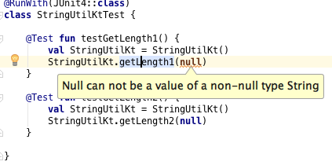
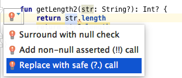
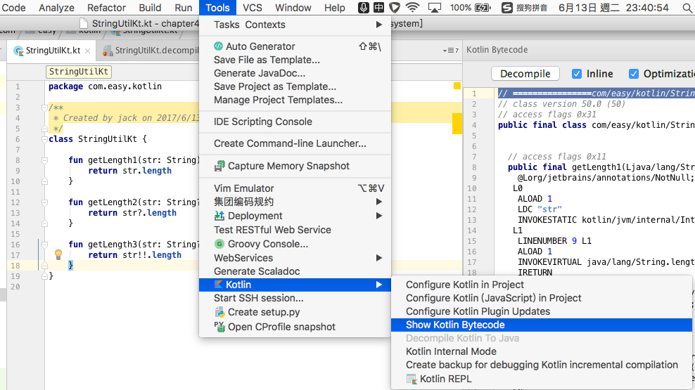
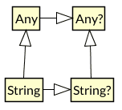
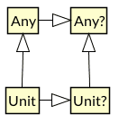
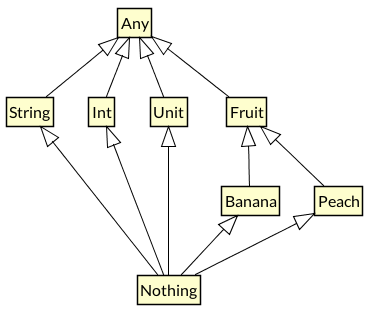
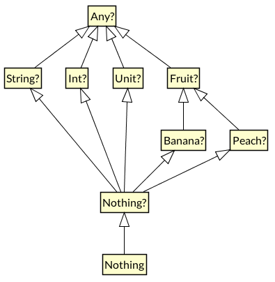
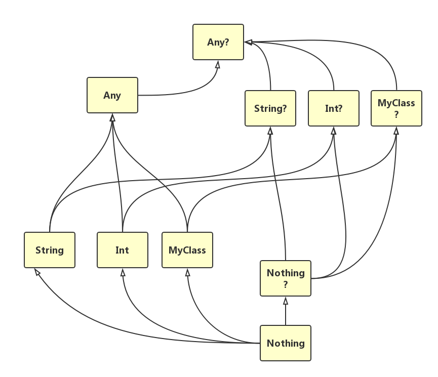

第4章 基本数据类型与类型系统
===

到目前为止，我们已经了解了Kotlin的基本符号以及基础语法。我们可以看出，使用Kotlin写的代码更简洁、可读性更好、更富有生产力。

本章我们来学习一下Kotlin的基本数据类型与类型系统。

> 道生一，一生二，二生三，三生万物 (老子《道德经》第四十二章)

在计算机科学中，最早的类型系统用来区别数字里面的整数和浮点数。

在20世纪五六十年代，这种分类扩展到了结构化的数据和高阶函数中。

70年代，引入了几个更为丰富的概念，例如：参数化类型，抽象数据类型，模块系统，子类型等等，类型系统作为一个独立的领域形成了。

在每一门编程语言中，都有一个特定的类型系统(Type System)。类型系统是一门编程语言最核心也是最基础的部分。我们这里说的类型系统，可以简单理解为以下两个部分：

- 一组基本类型构成的PTS（Primary Type Set，基本类型集合）；
- PTS上定义的一系列组合、运算、转换规则等。

这一简单优雅而惊人的世界构成观，贯穿了人类现实世界和计算机编程语言所定义的虚拟世界。或许语言的设计者也没有料想到，但是最终的结果确实是有限的设计导出了无限的可能性。

本章我们将学习Kotlin语言的基本类型，以及简单介绍Kotlin的类型系统。

## 4.1 什么是类型？

> 一切皆是映射

在计算机中，任何数值都是以一组比特（01）组成的，硬件无法区分内存地址、脚本、字符、整数、以及浮点数。这个时候，我们使用类型赋予一组比特以特定的意义。

类型（Type），本质上就是内存中的数值或变量对象的逻辑映射。

《周易》有云：

>易有太极，是生两仪，两仪生四象，四象生八卦。(《易传·系辞上传》) 。 

这里所包含的思想，跟我们这里所说的类型系统的思想有着异曲同工之妙。

类型系统用于定义如何将编程语言中的数值和表达式归类为许多不同的类型，如何操作这些类型，这些类型如何互相作用等。

类型系统在各种语言之间有非常大的不同，主要的差异存在于编译时期的语法，以及运行时期的操作实现方式。

类型系统提供的主要功能有：

- 安全性

编译器可以使用类型来检查无意义的，或者是可能无效的代码。例如，在强类型的语言中，如果没有对字符串的`+`进行重载，那么表达式

```
"Hello, World" + 3
```
就会被编译器检测出来，因为不能对字符串加上一个整数。强类型提供更多的安全性。

但是，为了让程序员可以写出极简的代码，很多语言都提供了操作符重载的机制。比如说，在Scala中，上面的代码是可以被正确执行的（重载了`+`操作符）

```
scala> "Hello,World"+1
res15: String = Hello,World1

scala> 1+"Hello,World"
res16: String = 1Hello,World
```

但是在Kotlin中， 由于`Int`类型没有对`+`实现重载，所以情况是这样

```
>>> "Hello,World"+1
Hello,World1
>>> 1+"Hello,World"
error: none of the following functions can be called with the arguments supplied: 
public final operator fun plus(other: Byte): Int defined in kotlin.Int
public final operator fun plus(other: Double): Double defined in kotlin.Int
public final operator fun plus(other: Float): Float defined in kotlin.Int
public final operator fun plus(other: Int): Int defined in kotlin.Int
public final operator fun plus(other: Long): Long defined in kotlin.Int
public final operator fun plus(other: Short): Int defined in kotlin.Int
1+"Hello,World"
 ^

```

- 最优化

静态类型检查可提供有用的信息给编译器。编译器可以使用更有效率的机器指令，实现编译器优化。

- 可读性

- 抽象化（或模块化）

类型本质上是对较低层次的逻辑单元进行高层次的逻辑抽象。这样我们就可以直接使用类型在较高层次的方式思考，而不是繁重的低层次实现。

例如，我们可以将字符串想成一个值，以此取代仅仅是字节的数组。字符串就是一个抽象数据类型。

从01到类型，从类型到接口API，再到软件服务，都可以看做是广义的“类型”范畴。

程序中的变量在程序执行期间，可能会有不同的取值范围，我们可以把变量可取值的最大范围称为这个变量的类型。例如，具有类型Boolean的变量x，在程序执行期间，只能取布尔值。指定变量类型的程序设计语言，称为类型化的语言（typed language）。

如果一个语言，不限制变量的取值，称为无类型语言（untyped language），我们既可以说它不具有类型，也可以说它具有一个通用类型，这个类型的取值范围是程序中所有可能的值。

类型系统是类型化语言的一个组成部分，它用来计算和跟踪程序中所有表达式的类型，从而判断某段程序是否表现良好（well behaved）。

如果程序语言的语法中含有类型标记，就称该语言是显式类型化的（explicitly typed），否则就称为隐式类型化的（implicitly typed）。

像C、C++、Java等语言，都是显式类型化的。而像ML、Haskell、Groovy等可以省略类型声明，它们的类型系统会自动推断出程序的类型。

## 4.2 编译时类型与运行时类型

>Koltin是一门强类型的、静态类型、支持隐式类型的显式类型语言。

### 4.2.1 弱类型（Weakly checked language）与强类型（Strongly checked language）

类型系统最主要的作用是，通过检查类型的运算和转换过程，来减少类型错误的发生。如果一个语言的编译器引入越多的类型检查的限制，就可以称这个语言的类型检查越强，反之越弱。根据类型检查的强弱，我们把编程语言分为

-  弱类型语言
-  强类型语言 

弱类型语言在运行时会隐式做数据类型转换。
强类型语言在运行时会确保不会发生未经明确转换（显式调用）的类型转换。

但是另一方面，强和弱只是相对的。

Kotlin是强类型语言。

### 4.2.2 静态类型（Statically checked language）与动态类型（Dynamically
checked language）

类型检查可发生在编译时期（静态检查）或运行时期（动态检查）。这样我们将编程语言分为

- 静态类型语言
- 动态类型语言

静态类型检查是基于编译器来分析源码本身来确保类型安全。静态类型检查能让很多bug在编码早期被捕捉到，并且它也能优化运行。因为如果编译器在编译时已经证明程序是类型安全的，就不用在运行时进行动态的类型检查，编译过后的代码会更优化，运行更快。

动态类型语言是在运行时期进行类型标记的检查，因为变量所约束的值，可经由运行路径获得不同的标记。关于动态类型，有个很形象的说法：

> 当看到一只鸟走起来像鸭子、游泳起来像鸭子、叫起来也像鸭子，那么这只鸟就可以被称为鸭子。——詹姆斯·惠特科姆·莱利（James Whitcomb Riley,1849-1916）

Kotlin是静态类型语言。

### 4.2.3 显式类型（Explicitly typed language）与隐式类型（Implicitly typed language）

还有一种区分方法是，根据变量名是否需要显式给出类型的声明，来将语言分为

- 显式类型语言
- 隐式类型语言

前者需要在定义变量时显式给出变量的类型，而后者可以使用类型推论来确定变量的类型。

大多数静态类型语言，例如 Java、C/C++ 都是显式类型语言。但是有些则不是，如 Haskell、ML 等，它们可以基于变量的操作来推断其类型；

Scala 是静态类型语言，它使用类型推断功能来支持隐式类型。

Kotlin 跟Scala类似，它也使用类型推断支持隐式类型。但是，在一些场景下也需要显式声明变量的类型，所以我们可以说，同时也是显式类型。

## 4.3 根类型Any

Kotlin 中所有类都有一个共同的超类 Any ，如果类声明时没有指定超类，则默认为 Any 。我们来看一段代码：

```kotlin
>>> val any = Any()
>>> any
java.lang.Object@2e377400
>>> any::class
class kotlin.Any
>>> any::class.java
class java.lang.Object
```

也就是说，Any在运行时，其类型自动映射成`java.lang.Object`。我们知道，在Java中Object类是所有引用类型的父类。但是不包括基本类型：`byte` `int` `long`等，基本类型对应的包装类是引用类型，其父类是Object。而在Kotlin中，直接统一——所有类型都是引用类型，统一继承父类`Any`。

Any是Java的等价Object类。但是跟Java不同的是，Kotlin中语言内部的类型和用户定义类型之间，并没有像Java那样划清界限。它们是同一类型层次结构的一部分。

Any 只有 equals() 、 hashCode() 和 toString() 三个方法。其源码是

```kotlin
public open class Any {
    /**
     * Indicates whether some other object is "equal to" this one. Implementations must fulfil the following
     * requirements:
     *
     * * Reflexive: for any non-null reference value x, x.equals(x) should return true.
     * * Symmetric: for any non-null reference values x and y, x.equals(y) should return true if and only if y.equals(x) returns true.
     * * Transitive:  for any non-null reference values x, y, and z, if x.equals(y) returns true and y.equals(z) returns true, then x.equals(z) should return true
     * * Consistent:  for any non-null reference values x and y, multiple invocations of x.equals(y) consistently return true or consistently return false, provided no information used in equals comparisons on the objects is modified.
     *
     * Note that the `==` operator in Kotlin code is translated into a call to [equals] when objects on both sides of the
     * operator are not null.
     */
    public open operator fun equals(other: Any?): Boolean

    /**
     * Returns a hash code value for the object.  The general contract of hashCode is:
     *
     * * Whenever it is invoked on the same object more than once, the hashCode method must consistently return the same integer, provided no information used in equals comparisons on the object is modified.
     * * If two objects are equal according to the equals() method, then calling the hashCode method on each of the two objects must produce the same integer result.
     */
    public open fun hashCode(): Int

    /**
     * Returns a string representation of the object.
     */
    public open fun toString(): String
}
```

### 4.3.1 对象相等性

从Any的源码注释中，我们可以看到，判断两个对象是否相等，需要满足以下条件：

- 自反性：对于任何非空引用值x，x.equals（x）应返回true。
- 对称性：对于任何非空引用值x和y，x.equals（y）应返回true当且仅当y.equals（x）返回true。
- 传递性：对于任何非空引用值x，y，z，如果x.equals（y）返回true，y.equals（z）返回true，那么x.equals（z）应返回true
- 一致性：对于任何非空引用值x和y，多次调用x.equals（y）始终返回true或者始终返回false。

另外，在Kotlin中，操作符`==`会被编译器翻译成调用`equals()` 函数。

## 4.4 基本类型（Primitive Types）

本节我们来探讨学习：Kotlin的基础类型：数字、字符、布尔和数组等。

我们知道Java的类型分成两种：一种是基本类型，一种是引用类型。它们的本质区别是：

> 基本类型是在堆栈处分配空间存“值”，而引用类型是在堆里面分配空间存“值”。

Java的基本类型有： byte、int、short、long、float、double、char、boolean，这些类都有对应的装箱类（引用类型）。

另外，void也可以算是一种特殊的基本类型，它也有一个装箱类`Void`（跟我们后文讲到的Unit、Nothing相关）。因为，Void是不能new出来的，也就是不能在堆里面分配空间存对应的值。所以，Void是一开始在堆栈处分配好空间。所以，将Void归成基本类型。

在Kotlin中，一切皆是对象。所有类型都是引用类型。没有类似Java中的基本类型。但是，可以把Kotlin中对应的这几种基本数据类型，理解为Java的基本类型的装箱类。

Integer.java

```java
public final class Integer extends Number implements Comparable<Integer> {
    /**
     * A constant holding the minimum value an {@code int} can
     * have, -2<sup>31</sup>.
     */
    @Native public static final int   MIN_VALUE = 0x80000000;

    /**
     * A constant holding the maximum value an {@code int} can
     * have, 2<sup>31</sup>-1.
     */
    @Native public static final int   MAX_VALUE = 0x7fffffff;

    /**
     * The {@code Class} instance representing the primitive type
     * {@code int}.
     *
     * @since   JDK1.1
     */
    @SuppressWarnings("unchecked")
    public static final Class<Integer>  TYPE = (Class<Integer>) Class.getPrimitiveClass("int");

    ...

}
```

Kotlin中的`Int`类型：

```kotlin
public class Int private constructor() : Number(), Comparable<Int> {
    companion object {
        /**
         * A constant holding the minimum value an instance of Int can have.
         */
        public const val MIN_VALUE: Int = -2147483648

        /**
         * A constant holding the maximum value an instance of Int can have.
         */
        public const val MAX_VALUE: Int = 2147483647
    }
    ...
}
```
我们通过Java的Integer封装类，跟Kotlin的Int类的定义可以看出两者的思想上的同源性。

Kotlin的基本类型的类图结构如下图所示


### 4.4.1 数字（Number）类型

Kotlin 提供了如下的内置类型来表示数字（与 Java 很相近）：

| 类型     | 宽度（Bit） |
| ------ | ------- |
| Double | 64      |
| Float  | 32      |
| Long   | 64      |
| Int    | 32      |
| Short  | 16      |
| Byte   | 8       |

从上面的Kotlin的基本类型的类的结构图，我们可以看出这些内置的数据类型，都继承了`Number`和 ` Comparable`类。例如，`Byte`类型的声明：

```kotlin
public class Byte private constructor() : Number(), Comparable<Byte> {
    ...
}
```

Kotlin 的数字类型跟 Java基本相同。有一点不同的是，Kotlin对于数字没有隐式拓宽转换（如 Java 中 `int` 可以隐式转换为`long`)。

注意在 Kotlin 中字符`Char`不是数字。这些基本数据类型，会在运行时自动优化为Java的double、float、long、int、short、byte。

### 字面常量值（literal constant values）

数值常量字面值有以下几种:

* 十进制: `123`
* Long 类型用大写 `L` 标记: `123L`
* 十六进制: `0x0F`
* 二进制: `0b00001011`

代码示例：

```kotlin
>>> 123
123
>>> 123::class
class kotlin.Int
>>> 123::class.java
int
>>> 123L
123
>>> 123L::class
class kotlin.Long
>>> 123L::class.java
long

>>> val b:Byte=128
error: the integer literal does not conform to the expected type Byte
val b:Byte=128
           ^

>>> val b:Byte=127
>>> b::class
class kotlin.Byte
>>> b::class.java
byte

>>> 0x0f
15
>>> 0x0F
15
>>> 0b1000
8
```

同样的，当我们赋值超过变量的类型的取值范围时，编译器会直接抛错。

注意: 不支持八进制

Kotlin 同样支持浮点数的常规表示方法:

* 默认 double：`123.5`、`123.5e10`
* Float 用 `f` 或者 `F` 标记: `123.5f`

代码示例：

```kotlin
>>> 1234.5
1234.5
>>> 1234.5::class
class kotlin.Double
>>> 1234.5::class.java
double
>>> 12.3e10
1.23E11
>>> 12.3e10::class
class kotlin.Double
>>> 456.7f
456.7
>>> 456.7f::class
class kotlin.Float
>>> 456.7f::class.java
float
```
我们也可以使用数字字面值中的下划线（自 1.1 起），使数字常量更易读：

```kotlin
>>> 1_000_000
1000000
>>> 1234_5678_9012_3456L
1234567890123456
>>> 0xFF_EC_DE_5E
4293713502
>>> 0b11010010_01101001_10010100_10010010
3530134674
```
在 Java 平台数字是物理存储为 JVM 的原生类型，除非我们需要一个可空的引用（如 `Int?`）或泛型。
后者情况下会把数字装箱。

#### 显式转换

由于不同的表示方式，值范围较小类型并不是较大类型的子类型，是不能隐式转换的。

代码示例：

```kotlin
>>> val a: Int? = 1
>>> val b: Long? = a
error: type mismatch: inferred type is Int? but Long? was expected
val b: Long? = a
               ^

>>> val b: Byte = 1
>>> val i: Int = b
error: type mismatch: inferred type is Byte but Int was expected
val i: Int = b
             ^

```

这意味着在不进行显式转换的情况下我们不能把 `Int` 型值赋给一个 `Long` 变量。也不能把 `Byte` 型值赋给一个 `Int` 变量。

我们可以显式转换来拓宽数字

```kotlin
>>> val i: Int = b.toInt() // OK: 显式拓宽
```

每个数字类型都继承Number抽象类，其中定义了如下的转换函数:

```kotlin
toDouble(): Double
toFloat(): Float
toLong(): Long
toInt(): Int
toChar(): Char
toShort(): Short
toByte(): Byte
```

所以，在数字之间的转换，我们直接调用上面的这些转换函数即可。

#### 运算符`+`重载

缺乏隐式类型转换并不显著，因为类型会从上下文推断出来，而算术运算会有重载做适当转换，例如：

```kotlin
val l = 1L + 3 // Long + Int => Long
```

这个是通过运算符`+`重载实现的。我们可以在Long类的源代码中看到这个`plus` 运算符函数的定义：

```kotlin
public operator fun plus(other: Byte): Long
public operator fun plus(other: Short): Long
public operator fun plus(other: Int): Long
public operator fun plus(other: Long): Long
public operator fun plus(other: Float): Float
public operator fun plus(other: Double): Double
```
也就是说， 编译器会把`1L + 3` 翻译成 `1L.plus(3)`，然后这个传入的参数类型必须是Byte、Short、Int、Long、Float、Double中的一种。例如，我们传入一个字符`Char`参数，编译器就会直接抛错：

```kotlin
>>> 'a'
a
>>> 'a'::class
class kotlin.Char
>>> 'a'::class.java
char
>>> 1L+'a'
error: none of the following functions can be called with the arguments supplied: 
public final operator fun plus(other: Byte): Long defined in kotlin.Long
public final operator fun plus(other: Double): Double defined in kotlin.Long
public final operator fun plus(other: Float): Float defined in kotlin.Long
public final operator fun plus(other: Int): Long defined in kotlin.Long
public final operator fun plus(other: Long): Long defined in kotlin.Long
public final operator fun plus(other: Short): Long defined in kotlin.Long
1L+'a'
  ^
```

#### 运算

Kotlin支持数字运算的标准集，运算被定义为相应的类成员（但编译器会将函数调用优化为相应的指令）。

对于位运算，没有特殊字符来表示，而只可用中缀方式调用命名函数（`infix fun`），例如:

```kotlin
val x = (1 shl 2) and 0x000FF000
```

这是完整的位运算列表（只用于 `Int` 和 `Long`）：

* `shl(bits)` – 有符号左移 (Java 的 `<<`)
* `shr(bits)` – 有符号右移 (Java 的 `>>`)
* `ushr(bits)` – 无符号右移 (Java 的 `>>>`)
* `and(bits)` – 位与
* `or(bits)` – 位或
* `xor(bits)` – 位异或
* `inv()` – 位非

### 4.4.2 Char: 字符(Character)类型与转义符（Escape character）

字符用 `Char` 类型表示。它们不能直接当作数字

```kotlin
fun check(c: Char) {
    if (c == 1) { // 错误：类型不兼容
        // ……
    }
}
```

字符字面值用 _单引号_ 括起来: `'1'`。
特殊字符可以用反斜杠转义。

Kotlin支持如下转义字符：

```
\t
\b
\n
\r
\`
\"
\\
\$

```

编码其他字符要用 Unicode 转义序列语法，例如：`'\uFF00'`。

Char类的函数接口定义如下：

```kotlin
public class Char private constructor() : Comparable<Char> {
    /**
     * Compares this value with the specified value for order.
     * Returns zero if this value is equal to the specified other value, a negative number if it's less than other,
     * or a positive number if it's greater than other.
     */
    public override fun compareTo(other: Char): Int

    /** Adds the other Int value to this value resulting a Char. */
    public operator fun plus(other: Int): Char

    /** Subtracts the other Char value from this value resulting an Int. */
    public operator fun minus(other: Char): Int
    /** Subtracts the other Int value from this value resulting a Char. */
    public operator fun minus(other: Int): Char

    /** Increments this value. */
    public operator fun inc(): Char
    /** Decrements this value. */
    public operator fun dec(): Char

    /** Creates a range from this value to the specified [other] value. */
    public operator fun rangeTo(other: Char): CharRange

    /** Returns the value of this character as a `Byte`. */
    public fun toByte(): Byte
    /** Returns the value of this character as a `Char`. */
    public fun toChar(): Char
    /** Returns the value of this character as a `Short`. */
    public fun toShort(): Short
    /** Returns the value of this character as a `Int`. */
    public fun toInt(): Int
    /** Returns the value of this character as a `Long`. */
    public fun toLong(): Long
    /** Returns the value of this character as a `Float`. */
    public fun toFloat(): Float
    /** Returns the value of this character as a `Double`. */
    public fun toDouble(): Double
}
```

我们来用代码示例这些函数的使用：

如果两个字符相等：
```kotlin
>>> 'a'.compareTo('a')
0
```

如果两个字符不相等：
```kotlin
>>> 'a'.compareTo('b')
-1
>>> 'a'.compareTo('c')
-1
>>> 'b'.compareTo('a')
1
>>> 'c'.compareTo('a')
1
```

Char字符只重载了加上`Int`类型的数字的`+`运算符：
```kotlin
>>> 'a'+1
b

>>> 'a'+1L
error: the integer literal does not conform to the expected type Int
'a'+1L
```
所以，当我们把一个`Char`类型值和不是`Int`类型的值相加，就报错了。

相减：
```kotlin
>>> 'a'-1
`
>>> 'c'-'a'
2
```

自增计算：

```kotlin
>>> var a='a'
>>> val b=a++
>>> a
b
>>> b
a
>>> val c=++a
>>> c
c
```
我们不能在字符的字面量上直接使用`++`:

```kotlin
>>> 'a'++
error: variable expected
'a'++
^

>>> ++'a'
error: variable expected
++'a'
  ^
```

范围

```kotlin
>>> 'a'.rangeTo('z')
a..z
>>> for(c in 'a'..'z') {print(c)}

abcdefghijklmnopqrstuvwxyz
```

`Char`的显式类型转换函数如下：

```kotlin
/** Returns the value of this character as a `Byte`. */
public fun toByte(): Byte
/** Returns the value of this character as a `Char`. */
public fun toChar(): Char
/** Returns the value of this character as a `Short`. */
public fun toShort(): Short
/** Returns the value of this character as a `Int`. */
public fun toInt(): Int
/** Returns the value of this character as a `Long`. */
public fun toLong(): Long
/** Returns the value of this character as a `Float`. */
public fun toFloat(): Float
/** Returns the value of this character as a `Double`. */
public fun toDouble(): Double
```

例如，我们显式把字符转换为 `Int` 数字：

```kotlin
fun decimalDigitValue(c: Char): Int {
    if (c !in '0'..'9')
        throw IllegalArgumentException("Out of range")
    return c.toInt() - '0'.toInt() // 显式转换为数字
}
```

测试代码：

```kotlin
>>> decimalDigitValue('a')
java.lang.IllegalArgumentException: Out of range
	at Line24.decimalDigitValue(Unknown Source)

>>> decimalDigitValue('1')
1
```

### 4.4.3 Boolean: 布尔类型

Kotlin的布尔类型用 `Boolean` 类来表示，它有两个值：`true` 和 `false`。

```kotlin
>>> true::class
class kotlin.Boolean
>>> true::class.java
boolean
```
对应Java中的`boolean`类型。

其源码定义如下：

```kotlin
package kotlin

/**
 * Represents a value which is either `true` or `false`. On the JVM, non-nullable values of this type are
 * represented as values of the primitive type `boolean`.
 */
public class Boolean private constructor() : Comparable<Boolean> {
    /**
     * Returns the inverse of this boolean.
     */
    public operator fun not(): Boolean

    /**
     * Performs a logical `and` operation between this Boolean and the [other] one.
     */
    public infix fun and(other: Boolean): Boolean

    /**
     * Performs a logical `or` operation between this Boolean and the [other] one.
     */
    public infix fun or(other: Boolean): Boolean

    /**
     * Performs a logical `xor` operation between this Boolean and the [other] one.
     */
    public infix fun xor(other: Boolean): Boolean

    public override fun compareTo(other: Boolean): Int
}
```

从上面我们可以看出，Boolean类的内置的布尔运算有：

* `!`  逻辑非 `not()`

* `&&`  短路逻辑与 `and()`

* `||`  短路逻辑或`or()`

* `xor` 异或(相同false，不同true)

另外，`Boolean`还继承实现了`Comparable`的`compareTo()`函数。

代码示例：

```kotlin
>>> !true
false
>>> true.not()
false
>>> true && true
true
>>> true.and(false)
false
>>> true || false
true
>>> false.or(false)
false
>>> true xor true
false
>>> true xor false
true
>>> false xor false
false
>>> true > false
true
>>> true < false
false
>>> true.compareTo(false)
1
>>> true.compareTo(false)
1
>>> true.compareTo(true)
0
>>> false.compareTo(true)
-1
```

### 4.4.4 String: 字符串类型

Kotlin的字符串用 `String` 类型表示。对应Java中的`java.lang.String`。字符串是不可变的。

```kotlin
>>> "abc"::class
class kotlin.String
>>> "abc"::class.java
class java.lang.String
```

另外，在Kotlin中，String同样是final不可继承的。

代码示例：

```kotlin
>>> class MyString:String
error: this type is final, so it cannot be inherited from
class MyString:String
               ^

```

#### 索引运算符 `s[i]`

字符串的元素——字符可以使用索引运算符 `s[i]`来访问。

```kotlin
>>> val s="abc"
>>> s
abc
>>> s[0]
a

```

当我们下标越界时，会抛越界错误：

```
>>> s[-1]
java.lang.StringIndexOutOfBoundsException: String index out of range: -1
	at java.lang.String.charAt(String.java:646)

>>> s[3]
java.lang.StringIndexOutOfBoundsException: String index out of range: 3
	at java.lang.String.charAt(String.java:646)
```
从出错信息，我们可以看出，索引运算符 `s[i]`会被翻译成`java.lang.String.charAt()`, 背后调用的是Java的String类。其调用的方法是：

```kotlin
public char charAt(int index) {
    if ((index < 0) || (index >= value.length)) {
        throw new StringIndexOutOfBoundsException(index);
    }
    return value[index];
}
```

####  `for` 循环迭代字符串

我们可以用 `for` 循环迭代字符串:

```kotlin
>>> for(c in "abc") { println(c)  }
a
b
c
```

关于字符串`String`类的完整的操作方法，我们可以看下源码：

```kotlin
public class String : Comparable<String>, CharSequence {
    companion object {}
    
    /**
     * Returns a string obtained by concatenating this string with the string representation of the given [other] object.
     */
    public operator fun plus(other: Any?): String

    public override val length: Int

    public override fun get(index: Int): Char

    public override fun subSequence(startIndex: Int, endIndex: Int): CharSequence

    public override fun compareTo(other: String): Int
}
```

类似的，字符串有一个`length`属性：

```kotlin
>>> "abc".length
3
```

#### 重载`+`操作符

字符串类重载了`+`操作符，作用对象可以是任何对象，包括空引用：

```kotlin
>>> "abc".plus(true)
abctrue
>>> "abc"+false
abcfalse
>>> "abc"+1
abc1
>>> "abc"+1.20
abc1.2
>>> "abc"+100L
abc100
>>> "abc"+"cdef"
abccdef
>>> "abc"+null
abcnull
>>> "abc"+'z'
abcz
>>> "abc"+arrayOf(1,2,3,4,5)
abc[Ljava.lang.Integer;@3d6f0054
```

截取字符串的子串：

```kotlin
>>> "abc".subSequence(0,1)
a
>>> "abc".subSequence(0,2)
ab
>>> "abc".subSequence(0,3)
abc
>>> "abc".subSequence(0,4)
java.lang.StringIndexOutOfBoundsException: String index out of range: 4
	at java.lang.String.substring(String.java:1951)
	at java.lang.String.subSequence(String.java:1991)
```

#### 字符串字面值

字符串的字面值，可以包含原生字符串可以包含换行和任意文本，也可以是带有转义字符（Escape Charactor）的转义字符串。

```kotlin
>>> val s = "Hello,World!\n\n\n"
>>> s
Hello,World!

>>> 
```

转义采用传统的反斜杠方式。

原生字符串使用三个引号（`"""`）分界符括起来，内部没有转义并且可以包含换行和任何其他字符:

```kotlin

>>> val text = """
...     for (c in "abc")
...         print(c)
... """
>>> text

    for (c in "foo")
        print(c)

>>> 
```

另外，在`package kotlin.text`下面的Indent.kt代码中，Kotlin还定义了`String`类的扩展函数：

```kotlin
fun String.trimMargin(marginPrefix: String = "|"): String
fun String.trimIndent(): String
```

我们可以使用`trimMargin()`、`trimIndent()` 裁剪函数来去除前导空格。可以看出，`trimMargin()`函数默认使用 `"|"` 来作为边界字符：

```kotlin
>>> val text = """
... |理论是你知道是这样，但它却不好用。
... |实践是它很好用，但你不知道是为什么。
... |程序员将理论和实践结合到一起：
... |既不好用，也不知道是为什么。
...     """
>>> text.trimMargin()
理论是你知道是这样，但它却不好用。
实践是它很好用，但你不知道是为什么。
程序员将理论和实践结合到一起：
既不好用，也不知道是为什么。
```

默认 `|` 用作边界前缀，但你可以选择其他字符并作为参数传入，比如 `trimMargin(">")`。

`trimIndent()`函数，则是把字符串行的左边空白对齐切割：

```kotlin
>>> val text="""
...              Hello
...                    World!
... """
>>> text.trimIndent()
Hello
      World!
>>> val text="""
...             Hello,
...         World!
... """
>>> text.trimIndent()
    Hello,
World!
```

#### 字符串模板

字符串可以包含*模板表达式* ，即一些小段代码，会求值并把结果合并到字符串中。
模板表达式以美元符（`$`）开头，由一个简单的名字构成:

```kotlin
>>> val h=100
>>> val str = "A hundred is $h"
>>> str
A hundred is 100
```

或者用花括号扩起来的任意表达式:

```kotlin
>>> val s = "abc"
>>> val str = "$s.length is ${s.length}"
>>> str
abc.length is 3
```

原生字符串和转义字符串内部都支持模板。

```kotlin
>>> val price=9.9
>>> val str="""Price is $$price"""
>>> str
Price is $9.9
>>> val str="Price is $$price"
>>> str
Price is $9.9

>>> val quantity=100
>>> val str="Quantity is $quantity"
>>> str
Quantity is 100
>>> val str="""Quantity is $quantity"""
>>> str
Quantity is 100
```

### 4.4.5 Array: 数组类型

数组在 Kotlin 中使用 `Array` 类来表示，它定义了 `get` 和 `set` 函数（映射到重载运算符 `[]`）和 `size` 属性，以及一个用于变量数组的`iterator()`函数：

```kotlin
class Array<T> private constructor() {
    val size: Int
    operator fun get(index: Int): T
    operator fun set(index: Int, value: T): Unit
    operator fun iterator(): Iterator<T>
    // ……
}
```

我们可以使用函数 `arrayOf()` 来创建一个数组并传递元素值给它。这个函数签名如下：

```kotlin
public inline fun <reified @PureReifiable T> arrayOf(vararg elements: T): Array<T>
```

其中，vararg表示是一个参数个数是一个变量。

例如， `arrayOf(1, 2, 3)` 创建了 array [1, 2, 3] :

```kotlin
>>> arrayOf(1,2,3)
[Ljava.lang.Integer;@4a37191a
>>> arrayOf(1,2,3)::class
class kotlin.Array
>>> arrayOf(1,2,3)::class.java
class [Ljava.lang.Integer;
```

另外，Kotlin还允许不同类型元素放到一个数组中，例如：

```kotlin
>>> val arr = arrayOf(1,"2",true)
>>> arr
[Ljava.lang.Object;@61af1510
>>> arr.forEach{ println(it) }
1
2
true
>>> arr.forEach{ println(it::class) }
class kotlin.Int
class kotlin.String
class kotlin.Boolean
```

Kotlin自动把这个数组元素的类型升级为`java.lang.Object`， 同时，由于Kotlin拥有的类型推断的功能，我们仍然可以看到每个数组元素对应的各自的类型。

函数 `arrayOfNulls()` 可以用于创建一个指定大小、元素都为空的数组。这个特殊的空数组在创建的时候，我们需要指定元素的类型。如果不指定，直接按照下面这样写，会报错：
```kotlin
>>> arrayOfNulls(10)
error: type inference failed: Not enough information to infer parameter T in fun <reified T> arrayOfNulls(size: Int): Array<T?>
Please specify it explicitly.

arrayOfNulls(10)
^
```

也就是说，我们要指定
```kotlin
>>> arrayOfNulls<Int>(10)
[Ljava.lang.Integer;@77c10a5f
>>> arrayOfNulls<Int>(10).forEach{println(it)}
null
null
null
null
null
null
null
null
null
null
```

数组`Array`类，还提供了一个构造函数：
```kotlin
public inline constructor(size: Int, init: (Int) -> T)
```
第1个参数是数组大小，第2个参数是一个初始化函数类型的参数（关于函数类型，我们将在后面章节介绍）。

代码示例：

```kotlin
>>> val square = Array(10, { i -> (i*i)})
>>> square
[Ljava.lang.Integer;@6f9e08d4
>>> square.forEach{ println(it) }
0
1
4
9
16
25
36
49
64
81
```

如上所述，`[]` 运算符代表调用成员函数 `get()` 和 `set()`。
代码示例：

```kotlin
>>> square[3]
9

>>> square[3]=1000
>>> square.forEach{ println(it) }
0
1
4
1000
16
25
36
49
64
81
```

与 Java 不同的是，Kotlin 中数组不是型变的（invariant）。 Kotlin中，我们不能把 `Array<String>` 赋值给 `Array<Any>`。这地方Kotlin类型检查的限制强于Java的数组类型。

代码示例：

```kotlin
>>> val arrstr = arrayOf<String>("1","2","3")
>>> arrstr
[Ljava.lang.String;@39374689
>>> var arrany = arrayOf<Any>(Any(),Any(),Any())
>>> arrany
[Ljava.lang.Object;@156324b
>>> arrany = arrstr
error: type mismatch: inferred type is Array<String> but Array<Any> was expected
arrany = arrstr
         ^
```

#### 原生数组类型

Kotlin 也有无装箱开销的专门的类来表示原生类型数组。这些原生数组类如下：

- BooleanArray
- ByteArray
- CharArray
- ShortArray
- IntArray
- LongArray
- FloatArray
- DoubleArray
- BooleanArray

这些类和 `Array` 并没有继承关系，但它们有同样的函数和属性集。它们也都有相应的工厂方法:
```kotlin
/**
 * Returns an array containing the specified [Double] numbers.
 */
public fun doubleArrayOf(vararg elements: Double): DoubleArray

/**
 * Returns an array containing the specified [Float] numbers.
 */
public fun floatArrayOf(vararg elements: Float): FloatArray

/**
 * Returns an array containing the specified [Long] numbers.
 */
public fun longArrayOf(vararg elements: Long): LongArray

/**
 * Returns an array containing the specified [Int] numbers.
 */
public fun intArrayOf(vararg elements: Int): IntArray

/**
 * Returns an array containing the specified characters.
 */
public fun charArrayOf(vararg elements: Char): CharArray

/**
 * Returns an array containing the specified [Short] numbers.
 */
public fun shortArrayOf(vararg elements: Short): ShortArray

/**
 * Returns an array containing the specified [Byte] numbers.
 */
public fun byteArrayOf(vararg elements: Byte): ByteArray

/**
 * Returns an array containing the specified boolean values.
 */
public fun booleanArrayOf(vararg elements: Boolean): BooleanArray
```

代码示例：

```kotlin
>>> val x: IntArray = intArrayOf(1, 2, 3)
>>> x[0]
1
```

## 4.5 `Any?`可空类型（Nullable Types）

可空类型是Kotlin类型系统的一个特性，主要是为了解决Java中的令人头疼的
NullPointerException问题。

我们知道，在Java中如果一个变量可以是`null`，来那么使用它调用一个方法就是不安全的，因为它会导致：`NullPointerException` 。

Kotlin把可空性（nullability）作为类型系统的一部分，Kotlin编译器可以直接在编译过程中发现许多可能的错误，并减少在运行时抛出异常的可能性。

Kotlin的类型系统和Java相比，首要的区别就是Kotlin对可空类型的显式支持。

在本节中，我们将讨论Kotlin中的可空类型。

### 4.5.1 null 是什么

对于Java程序员来说，null是令人头痛的东西。我们时常会受到空指针异常（NPE）的骚扰。就连Java的发明者都承认这是他的一项巨大失误。Java为什么要保留null呢？null出现有一段时间了，并且我认为Java发明者知道null与它解决的问题相比带来了更多的麻烦，但是null仍然陪伴着Java。

我们通常把`null`理解为编程语言中定义特殊的`0`, 把我们初始化的指针指向它，以防止“野指针”的恶果。在Java中，`null`是任何引用类型的默认值，不严格的说是所有Object类型的默认值。

这里的`null`既不是对象也不是一种类型，它仅是一种特殊的值，我们可以将其赋予任何引用类型，也可以将`null`转化成任何类型。在编译和运行时期，将`null`强制转换成任何引用类型都是可行的，在运行时期都不会抛出空指针异常。注意，这里指的是任何Java的引用类型。在遇到基本类型`int` `long` `float` `double` `short` `byte` 等的时候，情况就不一样了。而且还是个坑。编译器不会报错，但是运行时会抛NPE。空指针异常。这是Java中的自动拆箱导致的。代码示例：

```kotlin
Integer nullInt = null; // this is ok
int anotherInt = nullInt; // 编译器允许这么赋值, 但是在运行时抛 NullPointerException
```
所以，我们写Java代码的时候，要时刻注意这一点：Integer的默认值是null而不是0。当把null值传递给一个int型变量的时候，Java的自动装箱将会返回空指针异常。

### 4.5.2 Kotlin中的`null`

在Kotlin中，针对Java中的`null`的杂乱局面，进行了整顿，作了清晰的界定，并在编译器级别强制规范了可空null变量类型的使用。

我们来看一下Kotlin中关于`null`的一些有趣的运算。

`null`跟`null`是相等的：

```kotlin
>>> null==null
true
>>> null!=null
false
```

`null`这个值比较特殊，`null` 不是`Any`类型
```kotlin
>>> null is Any
false
```

但是，`null`是`Any?`类型：

```kotlin
>>> null is Any?
true
```

我们来看看`null`对应的类型到底是什么：
```kotlin
>>> var a=null
>>> a
null
>>> a=1
error: the integer literal does not conform to the expected type Nothing?
a=1
  ^
```

从报错信息我们可以看出，`null`的类型是`Nothing?`。关于`Nothing?`我们将会在下一小节中介绍。

我们可以对`null`进行加法运算：

```kotlin
>>> "1"+null
1null

>>> null+20
null20
```

对应的重载运算符的函数定义在`kotlin/Library.kt`里面：

```kotlin
package kotlin

import kotlin.internal.PureReifiable

/**
 * Returns a string representation of the object. Can be called with a null receiver, in which case
 * it returns the string "null".
 */
public fun Any?.toString(): String

/**
 * Concatenates this string with the string representation of the given [other] object. If either the receiver
 * or the [other] object are null, they are represented as the string "null".
 */
public operator fun String?.plus(other: Any?): String

...

```

但是，反过来就不行了：
```

>>> 1+null
error: none of the following functions can be called with the arguments supplied: 
public final operator fun plus(other: Byte): Int defined in kotlin.Int
public final operator fun plus(other: Double): Double defined in kotlin.Int
public final operator fun plus(other: Float): Float defined in kotlin.Int
public final operator fun plus(other: Int): Int defined in kotlin.Int
public final operator fun plus(other: Long): Long defined in kotlin.Int
public final operator fun plus(other: Short): Int defined in kotlin.Int
1+null
 ^
```

这是因为Int没有重载传入`null`参数的`plus()`函数。

### 4.5.3 可空类型`String?`与安全调用`?.`

我们来看一个例子。下面是计算字符串长度的简单Java方法：

```kotlin
public static int getLength1(String str) {
    return str.length();
}
```

我们已经习惯了在这样的Java代码中，加上这样的空判断处理：

```kotlin
public static int getLength2(String str) throws Exception {
    if (null == str) {
        throw new Exception("str is null");
    }

    return str.length();
}
```

而在Kotlin中，当我们同样写一个可能为`null`参数的函数时：

```kotlin
fun getLength1(str: String): Int {
    return str.length
}
```
当我们传入一个`null`参数时:

```kotlin
@Test fun testGetLength1() {
    val StringUtilKt = StringUtilKt()
    StringUtilKt.getLength1(null)
}
```

编译器就直接编译失败：

```
e: /Users/jack/easykotlin/chapter4_type_system/src/test/kotlin/com/easy/kotlin/StringUtilKtTest.kt: (15, 33): Null can not be a value of a non-null type String
:compileTestKotlin FAILED
FAILURE: Build failed with an exception.
* What went wrong:
Execution failed for task ':compileTestKotlin'.
> Compilation error. See log for more details
```
如果我们使用IDEA，会在编码时就直接提示错误了：



这样通过编译时强制排除空指针的错误，大大减少了出现NPE的可能。

另外，如果我们确实需要传入一个可空的参数，我们可以使用可空类型`String?`来声明一个可以指向空指针的变量。

可空类型可以用来标记任何一个变量，来表明这个变量是可空的（Nullable）。例如：
`Char?`, `Int?`, `MineType?`（自定义的类型）等等。

我们用示例代码来更加简洁的说明：

```kotlin
>>> var x:String="x"
>>> x=null
error: null can not be a value of a non-null type String
x=null
  ^

>>> var y:String?="y"
>>> y=null
>>> y
null

```

我们可以看出：普通`String`类型，是不允许指向`null`的；而可空`String?`类可以指向`null`。

下面我们来尝试使用一个可空变量来调用函数：

```kotlin
>>> fun getLength2(str: String?): Int? = str.length
error: only safe (?.) or non-null asserted (!!.) calls are allowed on a nullable receiver of type String?
fun getLength2(str: String?): Int? = str.length
                                        ^

```

编译器直接报错，告诉我们，变量`str: String?`是可空的类型，调用只能通过安全调用`?.` 或者 非空断言调用`!!.` 。

另外，如果不需要捕获异常来处理，我们可以使用Kotlin里面的安全调用符`?.` 。



代码示例：

```kotlin
fun getLength2(str: String?): Int? {
     return str?.length
}
```

测试代码：

```kotlin
@Test fun testGetLength2() {
    val StringUtilKt = StringUtilKt()
    println(StringUtilKt.getLength2(null)) //null
    Assert.assertTrue(3 == StringUtilKt.getLength2("abc"))
}
```
我们可以看出，当我们使用安全调用`?.` , 代码安静的执行输出了`null`。

如果，我们确实想写一个出现空指针异常的代码，那就使用可能出现空指针的断言调用符`!!.` 。 

代码示例：

```kotlin
fun getLength3(str: String?): Int? {
    return str!!.length
}
```

测试代码：

```kotlin
@Test fun testGetLength3() {
    val StringUtilKt = StringUtilKt()
    println(StringUtilKt.getLength3(null))
    Assert.assertTrue(3 == StringUtilKt.getLength3("abc"))
}
```

上面的代码就跟Java里面差不多了，运行会直接抛出空指针异常：

```kotlin
kotlin.KotlinNullPointerException
	at com.easy.kotlin.StringUtilKt.getLength3(StringUtilKt.kt:16)
	at com.easy.kotlin.StringUtilKtTest.testGetLength3(StringUtilKtTest.kt:28)
```

这里的`KotlinNullPointerException` 是KotlinNullPointerException.java代码，继承了Java中的`java.lang.NullPointerException`, 它的源代码如下：

```kotlin
package kotlin;

public class KotlinNullPointerException extends NullPointerException {
    public KotlinNullPointerException() {
    }

    public KotlinNullPointerException(String message) {
        super(message);
    }
}
```

另外，如果异常需要捕获到进行特殊处理的场景，在Kotlin中仍然使用 `try ... catch ` 捕获并处理异常。

### 4.5.4 可空性的实现原理

我们来看一段Kotlin的可空类型的示例代码如下：

```kotlin
fun testNullable1(x: String, y: String?): Int {
    return x.length
}

fun testNullable2(x: String, y: String?): Int? {
    return y?.length
}

fun testNullable3(x: String, y: String?): Int? {
    return y!!.length
}
```

我们来使用IDEA的Kotlin插件来看下可空类型的安全调用的等价Java代码。

打开IDEA的 `Tools > Kotlin > Show Kotlin Bytecode`



然后，点击`Decompile` , 我们可以得到反编译的Java代码

```kotlin
public final class NullableTypesKt {
   public static final int testNullable1(@NotNull String x, @Nullable String y) {
      Intrinsics.checkParameterIsNotNull(x, "x");
      return x.length();
   }

   @Nullable
   public static final Integer testNullable2(@NotNull String x, @Nullable String y) {
      Intrinsics.checkParameterIsNotNull(x, "x");
      return y != null?Integer.valueOf(y.length()):null;
   }

   @Nullable
   public static final Integer testNullable3(@NotNull String x, @Nullable String y) {
      Intrinsics.checkParameterIsNotNull(x, "x");
      if(y == null) {
         Intrinsics.throwNpe();
      }

      return Integer.valueOf(y.length());
   }
}
```

在不可空变量调用函数之前，都检查了是否为空, 使用的是`kotlin.jvm.internal.Intrinsics`这个Java类里面的`checkParameterIsNotNull`方法。如果是`null`就抛出异常：

```kotlin
public static void checkParameterIsNotNull(Object value, String paramName) {
    if (value == null) {
        throwParameterIsNullException(paramName);
    }
}
```

同时，我们可以看出在Kotlin中函数的入参声明

```
fun testNullable(x: String, y: String?) 
```
反编译成等价的Java代码是
```
public static final void testNullable(@NotNull String x, @Nullable String y) 
```
我们可以看出，这里使用注解`@NotNull`标注不可空的变量，使用注解`@Nullable`标注一个变量可空。

可空变量的安全调用符`y?.length` 等价的Java代码就是：

```kotlin
y != null?Integer.valueOf(y.length()):null
```

可空变量的断言调用`y!!.length`等价的Java代码是：
```kotlin
if(y == null) {
    Intrinsics.throwNpe();
}
return Integer.valueOf(y.length());
```

### 4.5.5 可空类型层次体系

就像`Any`是在非空类型层次结构的根，
`Any?`是可空类型层次的根。
由于`Any?`是Any的超集，所以，`Any?`是Kotlin的类型层次结构的最顶端。



代码示例：

```kotlin
>>> 1 is Any
true

>>> 1 is Any?
true

>>> null is Any
false

>>> null is Any?
true

>>> Any() is Any?
true
```

## 4.6 kotlin.Unit类型

Kotlin也是面向表达式的语言。在Kotlin中所有控制流语句都是表达式（除了变量赋值、异常等）。

Kotlin中的`Unit`类型实现了与Java中的`void`一样的功能。不同的是，当一个函数没有返回值的时候，我们用`Unit`来表示这个特征，而不是`null`。

大多数时候，我们并不需要显式地返回`Unit`，或者声明一个函数的返回类型为`Unit`。编译器会推断出它。

代码示例：

```kotlin
>>> fun unitExample(){println("Hello,Unit")}
>>> val helloUnit = unitExample()
Hello,Unit
>>> helloUnit
kotlin.Unit
>>> println(helloUnit)
kotlin.Unit

```

下面几种写法是等价的：

```kotlin
@RunWith(JUnit4::class)
class UnitDemoTest {
    @Test fun testUnitDemo() {
        val ur1 = unitReturn1()
        println(ur1) // kotlin.Unit
        val ur2 = unitReturn2()
        println(ur2) // kotlin.Unit
        val ur3 = unitReturn3()
        println(ur3) // kotlin.Unit
    }

    fun unitReturn1() {

    }

    fun unitReturn2() {
        return Unit
    }

    fun unitReturn3(): Unit {
    }
}
```

总的来说，这个`Unit`类型并没有什么特别之处。它的源码是：

```kotlin
package kotlin

/**
 * The type with only one value: the Unit object. This type corresponds to the `void` type in Java.
 */
public object Unit {
    override fun toString() = "kotlin.Unit"
}

```

跟任何其他类型一样，它的父类型是`Any`。如果是一个可空的`Unit?`，它的父类型是`Any?`。



## 4.7 kotlin.Nothing类型

Kotlin中没有类似Java和C中的函数没有返回值的标记`void`，但是拥有一个对应`Nothing`。在Java中，返回`void`的方法，其返回值`void`是无法被访问到的：

```kotlin
public class VoidDemo {
    public void voidDemo() {
        System.out.println("Hello,Void");
    }
}
```

测试代码：
```kotlin
@org.junit.runner.RunWith(org.junit.runners.JUnit4.class)
public class VoidDemoTest {
    @org.junit.Test
    public void testVoid() {
        VoidDemo voidDemo = new VoidDemo();
        void v = voidDemo.voidDemo(); // 没有void变量类型，无法访问到void返回值
        System.out.println(voidDemo.voidDemo()); // error: 'void' type not allowed here
    }
}
```
在Java中，`void`不能是变量的类型。也不能被当做值打印输出。但是，在Java中有个包装类`Void`是 `void` 的自动装箱类型。如果你想让一个方法返回类型 永远是 null 的话, 可以把返回类型置为这个大写的V的`Void`类型。

代码示例：

```kotlin
public Void voidDemo() {
    System.out.println("Hello,Void");
    return null;
}
```

测试代码：

```kotlin
@org.junit.runner.RunWith(org.junit.runners.JUnit4.class)
public class VoidDemoTest {
    @org.junit.Test
    public void testVoid() {
        VoidDemo voidDemo = new VoidDemo();
        Void v = voidDemo.voidDemo(); // Hello,Void
        System.out.println(v); // null
    }
}
```

这个`Void`就是Kotlin中的`Nothing?`。它的唯一可被访问到的返回值也是`null`。

在Kotlin类型层次结构的最底层就是类型`Nothing`。



正如它的名字Nothing所暗示的，`Nothing`是没有实例的类型。

代码示例：

```kotlin
>>> Nothing() is Any
error: cannot access '<init>': it is private in 'Nothing'
Nothing() is Any
^

```

注意：Unit与Nothing之间的区别:  Unit类型表达式计算结果的返回类型是Unit。Nothing类型的表达式计算结果是永远不会返回的（跟Java
中的`void`相同）。

例如，throw关键字中断的表达式的计算，并抛出堆栈的功能。所以，一个`throw Exception` 的代码就是返回`Nothing`的表达式。代码示例：

```kotlin
fun formatCell(value: Double): String =
    if (value.isNaN()) 
        throw IllegalArgumentException("$value is not a number")  // Nothing
    else 
        value.toString()
```

再例如, Kotlin的标准库里面的`exitProcess`函数:

```kotlin
@file:kotlin.jvm.JvmName("ProcessKt")
@file:kotlin.jvm.JvmVersion
package kotlin.system

/**
 * Terminates the currently running Java Virtual Machine. The
 * argument serves as a status code; by convention, a nonzero status
 * code indicates abnormal termination.
 *
 * This method never returns normally.
 */
@kotlin.internal.InlineOnly
public inline fun exitProcess(status: Int): Nothing {
    System.exit(status)
    throw RuntimeException("System.exit returned normally, while it was supposed to halt JVM.")
}
```

Nothing?可以只包含一个值：null。代码示例：

```kotlin
>>> var nul:Nothing?=null
>>> nul = 1
error: the integer literal does not conform to the expected type Nothing?
nul = 1
      ^

>>> nul = true
error: the boolean literal does not conform to the expected type Nothing?
nul = true
      ^

>>> nul = null
>>> nul
null
```

从上面的代码示例，我们可以看出：`Nothing?`它唯一允许的值是`null`，被用作任何可空类型的空引用。



综上所述，我们可以看出Kotlin有一个简单而一致的类型系统。`Any?`是整个类型体系的顶部，`Nothing`是底部。如下图所示：



## 4.8 类型检测与类型转换

### 4.8.1 is,!is运算符

is运算符可以检查对象是否与特定的类型兼容（“兼容”的意思是：此对象是该类型，或者派生于该类型）。

is运算符用来检查对象（变量）是否属于某数据类型（如Int、String、Boolean等）。C#里面也有这个运算符。

`is`运算符类似Java的`instanceof`:
```kotlin
@org.junit.runner.RunWith(org.junit.runners.JUnit4.class)
public class TypeSystemDemo {
    @org.junit.Test
    public void testVoid() {
        if ("abc" instanceof String) {
            println("abc is instanceof String");
        } else {
            println("abc is not instanceof String");
        }
    }

    void println(Object obj) {
        System.out.println(obj);
    }
}
```

在Kotlin中，我们可以在运行时通过使用 `is` 操作符或其否定形式 `!is` 来检查对象是否符合给定类型：

```kotlin
>>> "abc" is String
true
>>> "abc" !is String
false

>>> null is Any
false
>>> null is Any?
true
```

代码示例：

```kotlin
@RunWith(JUnit4::class)
class ASOperatorTest {
    @Test fun testAS() {
        val foo = Foo()
        val goo = Goo()
        println(foo is Foo) //true 自己
        println(goo is Foo)// 子类 is 父类 = true
        println(foo is Goo)//父类 is 子类 = false
        println(goo is Goo)//true 自己
    }
}

open class Foo
class Goo : Foo()
```

#### 类型自动转换

在Java代码中，当我们使用`str instanceof String`来判断其值为`true`的时候，我们想使用str变量，还需要显式的强制转换类型：

```kotlin
@org.junit.runner.RunWith(org.junit.runners.JUnit4.class)
public class TypeSystemDemo {
    @org.junit.Test
    public void testVoid() {
        Object str = "abc";
        if (str instanceof String) {
            int len = ((String)str).length();  // 显式的强制转换类型为String
            println(str + " is instanceof String");
            println("Length: " + len);

        } else {
            println(str + " is not instanceof String");
        }

        boolean is = "1" instanceof String;
        println(is);
    }

    void println(Object obj) {
        System.out.println(obj);
    }
}
```

而大多数情况下，我们不需要在 Kotlin 中使用显式转换操作符，因为编译器跟踪不可变值的 is-检查，并在需要时自动插入（安全的）转换：
```kotlin
@Test fun testIS() {
    val len = strlen("abc")
    println(len) // 3
    val lens = strlen(1)
    println(lens) // 1
}

fun strlen(ani: Any): Int {
    if (ani is String) {
        return ani.length
    } else if (ani is Number) {
        return ani.toString().length
    } else if (ani is Char) {
        return 1
    } else if (ani is Boolean) {
        return 1
    }

    print("Not A String")
    return -1
}
```

### 4.8.2 as运算符

as运算符用于执行引用类型的显式类型转换。如果要转换的类型与指定的类型兼容，转换就会成功进行；如果类型不兼容，使用`as?`运算符就会返回值null。

代码示例：

```kotlin
>>> open class Foo
>>> class Goo:Foo()
>>> val foo = Foo()
>>> val goo = Goo()

>>> foo as Goo
java.lang.ClassCastException: Line69$Foo cannot be cast to Line71$Goo

>>> foo as? Goo
null

>>> goo as Foo
Line71$Goo@73dce0e6

```

我们可以看出，在Kotlin中，子类是禁止转换为父类型的。

按照Liskov替换原则，父类转换为子类是对OOP的严重违反，不提倡、也不建议。严格来说，父类是不能转换为子类的，子类包含了父类所有的方法和属性，而父类则未必具有和子类同样成员范围，所以这种转换是不被允许的，即便是两个具有父子关系的空类型，也是如此。

## 本章小结

在本章中，我们停下脚步，仔细深入地去探讨了Kotlin语言中最重要的部分之一的：类型系统。

与Java相比，Kotlin的类型系统更加简单一致，同时引入了一些新的特性，这些特性对于提高代码的安全性、可靠性至关重要。例如：可空类型和只读集合。关于只读集合类，我们将在下一章中介绍。

我们下一章的主题是：Kotlin的集合类和泛型。

本章示例代码工程：https://github.com/EasyKotlin/chapter4_type_system

## 参考资料

1.https://jetbrains.github.io/kotlin-spec/#_the_kotlin_nothing_type

2.http://natpryce.com/articles/000818.html

