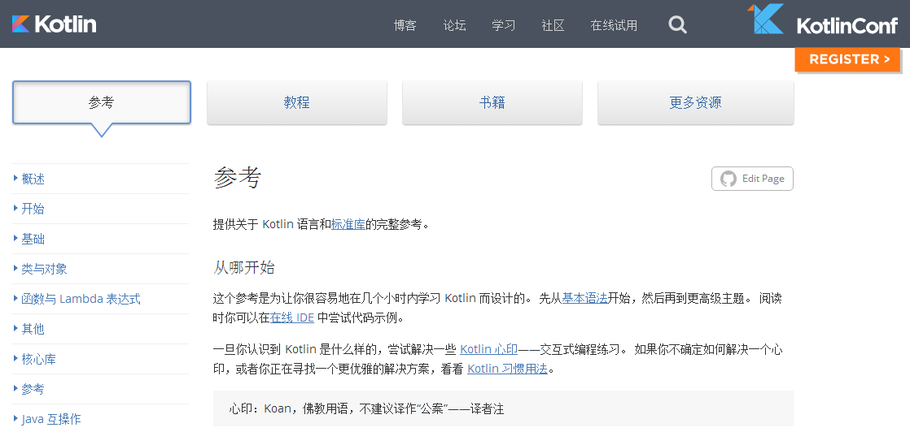
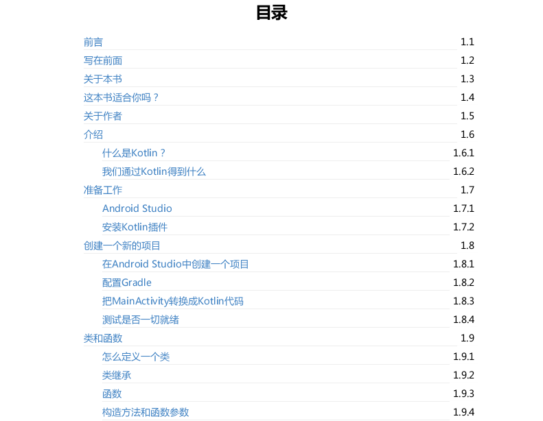

## Kotlin极简教程

> 十年生死两茫茫，不思量，自难忘，华年短暂，陈辞岁月悠悠伤，
>
> 满腔热血已芜荒，展未来，后生强，战战兢兢，如履薄冰心彷徨，
>
> 青丝化雪、鬓角成霜，已是英雄迟暮，人生怎慷慨激昂？

对于一个开发者而言，能够胜任系统中任意一个模块的开发是其核心价值的体现。

对于一个架构师而言，掌握各种语言的优势并可以运用到系统中，由此简化系统的开发，是其架构生涯的第一步。

对于一个开发团队而言，能在短期内开发出用户满意的软件系统是起核心竞争力的体现。

每一个程序员都不能固步自封，要多接触新的行业，新的技术领域，突破自我。

GitHub托管主页：https://github.com/JackChan1999/EasyKotlin

GitBook在线阅读、电子书下载：https://www.gitbook.com/book/alleniverson/easykotlin/details

### Kotlin 语言中文站

### Kotlin 语言官方参考文档 中文版

> https://www.gitbook.com/book/hltj/kotlin-reference-chinese/details

### 《Kotlin for android developers》中文版翻译

> GitHub：https://github.com/wangjiegulu/kotlin-for-android-developers-zh
>
> 英文原版：https://leanpub.com/kotlin-for-android-developers
>
> [GitBook（电子书下载、在线阅读）](https://www.gitbook.com/book/alleniverson/kotlin-for-android-developers/details)

## 关注我

- Email：<619888095@qq.com>
- CSDN博客：[Allen Iverson](http://blog.csdn.net/axi295309066)
- 新浪微博：[AndroidDeveloper](http://weibo.com/u/1848214604?topnav=1&wvr=6&topsug=1&is_all=1)
- GitHub：[JackChan1999](https://github.com/JackChan1999)
- GitBook：[alleniverson](https://www.gitbook.com/@alleniverson)
- 个人博客：[JackChan](https://jackchan1999.github.io/)