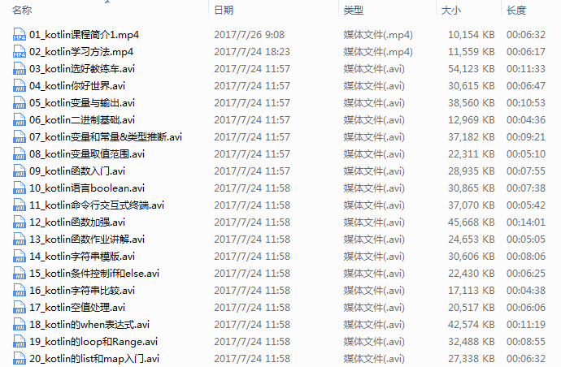

## Kotlin 从零基础到进阶

## kotlin教程目录

01_kotlin课程简介

02_kotlin学习方法

03_kotlin选好教练车

04_kotlin你好世界

05_kotlin变量与输出

06_kotlin二进制基础

07_kotlin变量和常量&类型推断

08_kotlin变量取值范围

09_kotlin函数入门

10_kotlin语言boolean

11_kotlin命令行交互式终端

12_kotlin函数加强

13_kotlin函数作业讲解

14_kotlin字符串模版

15_kotlin条件控制if和else

16_kotlin字符串比较

17_kotlin空值处理

18_kotlin的when表达式

19_kotlin的loop和Range

20_kotlin的list和map入门

21_kotlin函数和函数式表达式

22_kotlin默认参数和具名参数

23_kotlin字符串和数字之间的转换

24_kotlin人机交互

25_kotlin异常处理

26_kotlin递归

27_kotlin尾递归优化

28_kotlin新的篇章idea使用入门

29_kotlin面向对象入门

30_kotlin静态属性和动态行为

31_kotlin面向对象

32_kotlin面向对象实战-洗衣机

33_kotlin面向对象实战-洗衣机升级

34_kotlin面向对象实战-封装

35_kotlin面向对象-继承(open和override)

36_kotlin抽象类和继承

37_kotlin面向对象-多态

38_kotlin面向对象-抽象类和接口

39_kotlin面向对象-代理和委托

40_kotlin面向对象-单例模式

41_kotlin面向对象-枚举

42_kotlin面向对象-印章类

43_kotlin课程计划