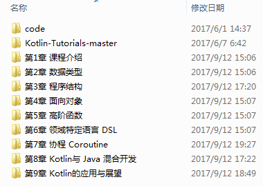

## Kotlin 系统入门到进阶

### 第1章 课程介绍

本章主要介绍什么是Kotlin，课程安排，以及开发环境的配置。

### 第2章 数据类型

本章主要讲解 Kotlin 的基本词法，从类型系统入手为大家介绍 Kotlin 中都存在哪些类型，以及相关的特性。（知识点：基本类型、类与对象、空类型、智能类型转换、包、区间、数组）

### 第3章 程序结构

本章主要讲解 Kotlin 的句法，从程序结构入手为大家介绍 Kotlin 有哪些表达式，有哪些语句，如何定义常量、变量以及函数等等。（知识点：常量与变量 、函数、Lambda表达式、类成员、运算符、分支表达式、循环语句、异常捕获 、函数的具名参数、函数的变长参数、函数的默认参数、案例：一个命令行计算器、导出可执行程...

### 第4章 面向对象

本章深入探讨 Kotlin 的面向对象的知识，包括抽象、继承，扩展成员、属性代理以及常见类的概念及特性。（知识点：面向对象的基本概念、抽象类与接口、 子承父业的故事、类及其成员的可见性、object、伴生对象与静态成员、方法重载和默认参数、扩展成员、属性代理、数据类、内部类、枚举、密封类）...

### 第5章 高阶函数

本章深入探讨 Kotlin 的高阶函数的知识，学习常见的内置高阶函数的用法，并对常见高阶函数的相关概念如闭包、复合、科里化等做简要介绍。（知识点：基本概念、常见高阶函数、尾递归优化、闭包、函数复合、科里化 Currying、 偏函数、一个统计字符个数的小例子）...

### 第6章 领域特定语言 DSL

本章介绍领域特定语言 DSL 的概念，以及如何使用 Kotlin 编写 DSL。（知识点：DSL 的基本概念、案例：HTML DSL、Gradle Kotlin 脚本）

### 第7章 协程 Coroutine

本章介绍 Kotlin 的协程，主要包括基本 API 的使用，协程执行流程的分析，以及协程相关应用的案例和框架介绍。（知识点：基本概念、案例：异步下载图片、 协程的原理剖析、序列生成器、Kotlinx.coroutines框架简介）

### 第8章 Kotlin与 Java 混合开发

本章主要对 Kotlin 与 Java 混合开发常见的问题进行了梳理。（知识点：基本互操作、SAM转换、正则表达式、集合框架、IO操作、装箱和拆箱、注解处理器）

### 第9章 Kotlin的应用与展望

本章主要为大家演示如何编写 Kotlin 脚本，如何开发服务端程序， 如何开发 Android 应用，如何开发前端程序，以及如何使用 Kotlin-Native 将 Kotlin 直接编译为可执行程序并在操作系统上直接运行。（知识点：Kotlin的应用场景、 Kotlin-Script的例子、Kotlin-Android的例子、Kotlin-JavaScript的例子、 Kotlin-springboot的例子、Kotlin-Native 的例子)